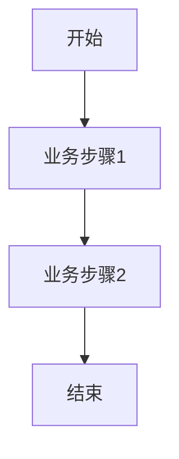

# TECH-系统名称-功能模块

## 1. [功能模块名称]

### 1.1. 模块概述

[请在此处描述该功能模块的核心目标、在整个系统中的定位和作用。]

### 1.2. 功能点列表

* **[功能点1]**：[简要描述功能点]
* **[功能点2]**：[简要描述功能点]
* ...

### 1.3. 详细功能描述 (平台无关业务实现)

#### 1.3.1. [功能点1]

* **功能描述**：[详细描述功能点的作用和业务目标。]
* **业务规则**：[描述所有相关的业务逻辑、约束条件和计算规则。]
  * [规则1]
  * [规则2]
* **抽象界面描述/原型**：[描述用户与该功能交互的抽象界面元素和流程，可附带截图或链接。此处仅描述抽象界面，不涉及具体平台UI细节。]
* **业务逻辑流程图**：[使用Mermaid或其他工具绘制流程图或时序图，可视化展现功能执行步骤的业务逻辑，不涉及平台配置流。]

* **数据模型关联**：[说明该功能点与哪些抽象数据实体相关，以及如何操作这些数据。]
* **权限说明**：[说明哪些业务角色可以执行该功能，可链接到业务层面的权限管理文档。]

#### 1.3.2. [功能点2]

* ...

### 1.4. 业务依赖与集成

[请在此处说明该功能模块对其他业务模块的依赖，以及与外部系统的抽象集成点（不涉及具体实现方式）。]

### 1.5. 性能与安全性考虑

[请在此处简要提及该功能模块在性能和安全性方面的特殊要求或设计考虑。]

## 2. [其他功能模块名称]

* ...
