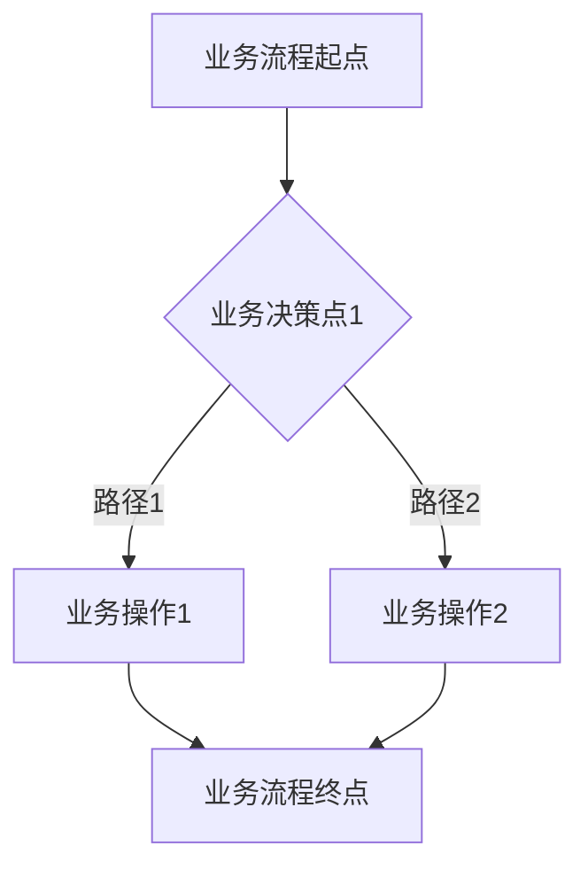

# TECH-系统名称-审批流程

## 1. 审批流程概述

[请在此处概述本审批流程文档的目的，说明系统中涉及的各项业务审批流程。侧重于业务逻辑，不涉及具体平台配置。]

## 2. [业务审批流程名称1]

### 2.1. 业务流程图

[请在此处绘制或描述该业务审批流程的流程图。侧重于业务逻辑，不涉及具体平台上的配置步骤。]

### 2.2. 业务流程说明

1. **[业务步骤1]**：[详细描述流程的第一个业务步骤，包括触发条件、提交内容等。]
2. **[业务步骤2]**：[详细描述流程的第二个业务步骤，包括业务审批角色、审批条件、审批操作和业务流转规则。]
    * **业务审批角色**：[说明业务审批角色。]
    * **业务审批条件**：[说明触发审批的业务条件。]
    * **业务审批操作**：[说明业务审批角色可进行的操作（批准/驳回）。]
    * **业务流转**：[说明业务流程根据审批结果如何流转。]
3. ...

## 3. [其他业务审批流程名称]

* ...

## 4. 平台流程配置 (请参考平台配置详情文档)

[请在此处说明，具体平台上的流程配置细节请参考《TECH-系统名称-平台配置详情.md》文档中的相关章节。]
