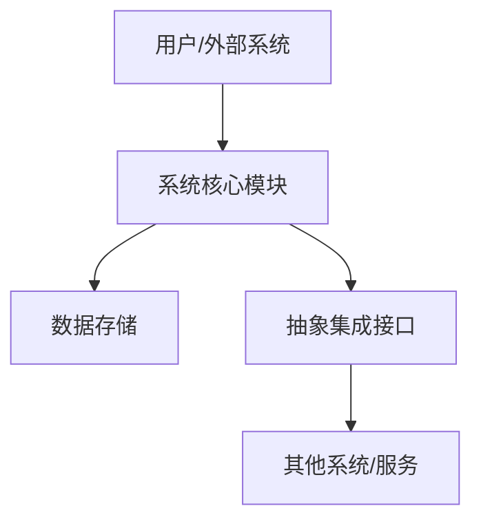
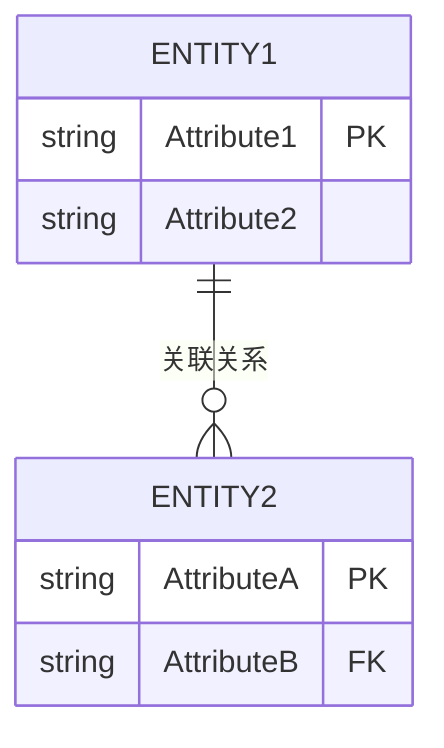
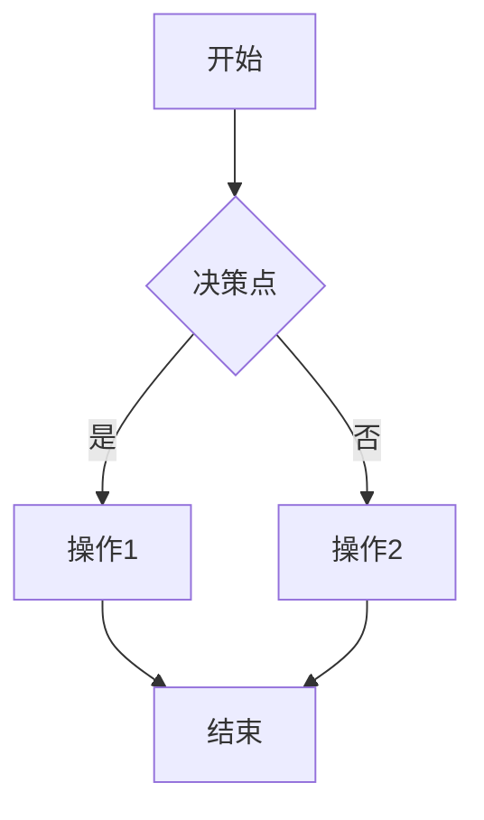

# TECH-系统名称-系统设计

## 1. 总体架构设计

### 1.1. 系统架构图

[请在此处详细描述系统的整体架构，包括主要组件、分层结构、技术选型等。侧重于抽象设计，不涉及具体平台实现细节。]

### 1.2. 架构说明

[请在此处对系统架构图进行文字说明，解释各组件的作用和相互关系。]

## 2. 数据模型设计

### 2.1. 实体关系图 (ERD) 概览

[请在此处绘制或描述系统的主要数据实体及其关系。侧重于业务数据模型，不涉及具体数据库表结构。]

### 2.2. 数据模型说明

[请在此处对数据模型进行文字说明，解释各实体及其属性的含义和作用。]

## 3. 核心业务流程逻辑设计

### 3.1. [核心业务流程名称]

[请在此处绘制或描述系统的主要业务流程逻辑，如数据流、业务逻辑流等。侧重于平台无关的业务逻辑，不涉及具体平台上的配置步骤。]

### 3.2. [其他核心业务流程名称]

[请在此处绘制或描述其他关键业务流程。]

## 4. 抽象权限设计

### 4.1. 角色定义与职责

[请在此处定义系统中的主要业务角色及其职责。]

### 4.2. 抽象权限矩阵

| 功能模块/操作 | 角色1 | 角色2 | ... |
| :------------ | :---- | :---- | :-- |
| [功能名称]    | [权限] | [权限] | ... |
[请在此处列出各角色对不同功能模块或具体操作的业务权限。侧重于业务规定，不涉及平台配置。]

## 5. 界面原型设计 (可选)

[请在此处提供主要系统界面的草图或示意图，或链接到外部原型工具。]
