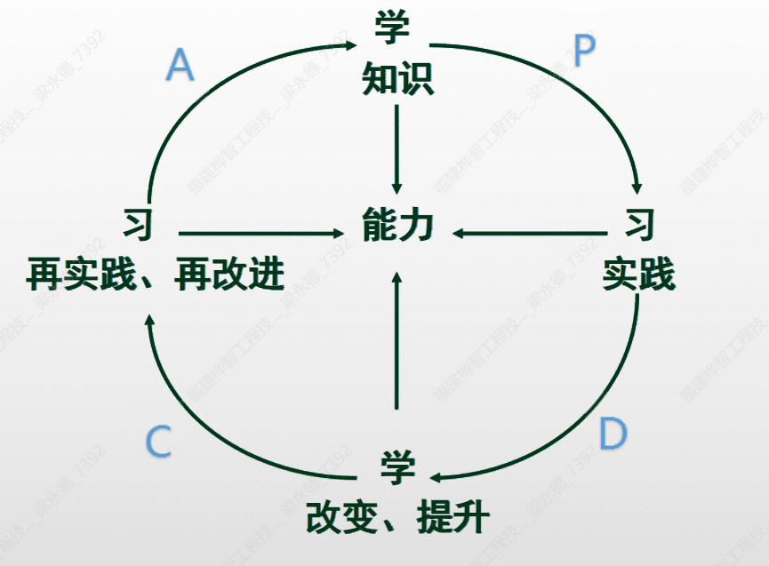

# 高效人士自我管理工具

## 为什么使用《五项管理 行动日志》

渴望成功的路上，会遇到以下10大障碍

1. 消极思维，悲观失望
2. 没有目标，过一天算一天；有梦想，但不知道如何将梦想落实到每一天
3. 想学习，渴望成长，但不能坚持
4. 遇到困难时，半途而废
5. 压力太大，焦虑不安
6. 不愿意承担责任，总是找借口
7. 做事情缺乏专注，三心二意
8. 缺乏信心，不敢尝试，害怕失败
9. 自私自利，不愿意帮助别人
10. 想得太多，落实太少，缺乏行动力

## 五项管理是什么，它带给我们什么好处？

第一项心态管理----带来快乐
第二项目标管理----规划人生
第三项时间管理----培养高效
第四项学习管理----持续改进
第五项行动管理----养成习惯

### 如何使用行动日志

1. 每日记录
2. 每日管理
3. 每日学习
4. 每日总结
5. 每日成长

## 第一项 心态管理

| 心态评估     | 目的     | 10分标准         | 0分标准                    |
| ------------ | -------- | ---------------- | -------------------------- |
| 认真         | 高品质   | 第一次做好       | 马虎、投入不够、有缺陷     |
| 快           | 高效     | 当日事当日毕     | 拖延、无价值创造、浪费时间 |
| 坚守承诺     | 诚信     | 说到做到         | 虚假、不诚实               |
| 保证完成任务 | 达成目标 | 100%的目标完成率 | 放弃或不能坚持             |
| 乐观         | 快乐     | 积极思维         | 悲观失望、抱怨、指责       |
| 自信         | 有自信   | 接受挑战         | 说“不可能”，怀疑、害怕     |
| 爱与奉献     | 给予     | 帮助别人         | 索取、自私                 |
| 绝不找借口   | 承担责任 | 不找借口         | 找借口、找理由、受害者感受 |

心态管理自我评估

每日心态管理：以下每项做到10分，未做到0分

认真__分    快__分    坚守承诺__分    保证完成任务__分
乐观__分    自信__分  爱与奉献__分    决不找借口__分

## 第二项 目标管理

1. 对生命的规划————设计人生航海图
2. 设定方法————以终为始

> 成功就是设定有意义的目标，并达成目标

### 以终为始

1. 终极目标（60岁后）
2. 远期目标（10年）
3. 中期目标（5年）
4. 近期目标（1-3年）
5. 本年目标
6. 月目标
7. 周目标
8. 日目标

### 目标包括哪些？

工作、家庭生活、人际关系、成长、财富、健康

### 目标管理的重要建议

1. 强烈的企图心
2. 将目标视觉化
3. 遵循以下步骤设定和执行目标

### 目标管理具体实施

#### 1. 提前设定目标、写下来

   1. 头一天晚上设定明日目标
   2. 周末设定下周目标
   3. 月末设定下月目标
   4. 年末设定明年目标

- 年末设定下年度目标

| 类别 | 序号 | 目标内容 | 方法和措施 | 起止时间 | 完成打✔ |
| ---- | ---- | -------- | ---------- | -------- | -------- |

- 月末设定下月目标

| 类别 | 重要级别 | 目标内容 | 方法和措施 | 完成打✔ |
| ---- | -------- | -------- | ---------- | -------- |

- 周末设定下周目标

> 请看一下你的“月计划”
> 请在本周一前规划填写
> 按目标重要程度规划优先顺序

| 重要级别 | 本周工作目标 | 完成期限 | 完成情况 |
| -------- | ------------ | -------- | -------- |

- 周日设定下周一目标

> 根据事项重要程度按A、B、C分级标注

| 重要级别              | 时间 | 今日事项 要事第一 | 做到打✔ |
| --------------------- | ---- | ----------------- | -------- |
| 完成日目标（百分比%） |   100%   |                   |        |

#### 2. 坚持改进

- 每日总结、思考、改进
- 每周总结、找差距、制定改进计划和时间表
- 每月总结、找差距、制定改进计划和时间表

| 2025.53 周总结               |
| ---------------------- |
| 目标完成情况           |
|                        |
| 未完成目标的原因和障碍 |
|                        |
| 克服障碍的对策和方法   |
|                        |
| 本周的创新与收获       |
|                        |

| 2025.06 月总结               |
| ---------------------- |
| 目标完成情况           |
|                        |
| 未完成目标的原因和障碍 |
|                        |
| 克服障碍的对策和方法   |
|                        |
| 本月的创新与收获       |
|                        |

#### 3. 定期评估检查

- 针对员工的检查方法————三每三对照
  - 部门经理每天晨会对照目标，帮助员工抓住重点
  - 部门经理每天根据员工晨会制定目标跟进过程
  - 部门经理每天夕会对照目标，帮员工总结结果，持续改进
- 针对中层的检查方法————周业绩会议
  - 总经理每周一对照上周目标，评估达成结果，找差距，找方法

## 第三项 时间管理

是生命质量的管理，人生有限，事情无限

### 要事第一

- 分清优先顺序
- A B C法则
  - A类 非常重要————自己做
  - B类 重要————压缩做或延期做
  - C类 次重要————授权做

### 如何判断最重要

- 大价值
- 没有二次机会
- 不能授权

> 成功秘诀：用最佳精力，大块时间集中保证第一优先工作完成！

> 填写日目标时
>
> - 第一步：预先记录事项
> - 第二步：分清重要级别
> - 第三步：分配时间（大块时间，集中确保重要事项）
> - 第四步：对不重要的事情可以不做

## 第四项 学习管理

只有学习，才有创新力
只有力创新力，才有竞争力

### 一、不学习可能的后果

1. 一切失败，皆因无知
2. 知识过期，思维僵化
3. 没有终身岗位，缺少保障
4. 变化太快，未来无法预测

### 二、学习的目的

1. 增加自我价值
2. 创造价值

### 三、学习的重要性

只有不断学习，才能持续成功

### 四、学习的动力

1. 要胸怀大志，设立高远目标
2. 要有危机意识，居危思危

### 五、学习的捷径

1. 向一流人士学习————复制成功
2. 每天养成学习习惯————聚沙成塔

### 六、最新学习模式

## 第五项 行动管理

养成习惯

### 如何将《行动日志》坚持到底

1. 培训引导
2. 制度推行
   1. 两会制度————晨会、夕会
   2. 三每三对照制度
      1. 每人    对照目标
      2. 每天    对照过程
      3. 每件事  对照结果
   3. 监督检查
      1. 部门经理每天检查
      2. 公司每周检查
      3. 每项扣绩效分值，部门经理连带处罚
      4. 形成企业文化，勉强成习惯，习惯成自然

### 用行动日志为企业带来的好处

个人效率的综合=企业效率
人才的竞争取决于人才品质的竞争
人才的竞争决定企业的竞争

## 小结

1. 心态是成功的基础
2. 目标是成功的殿堂
3. 时间是成功的效率
4. 学习是成功的源泉
5. 行动是成功的保证
