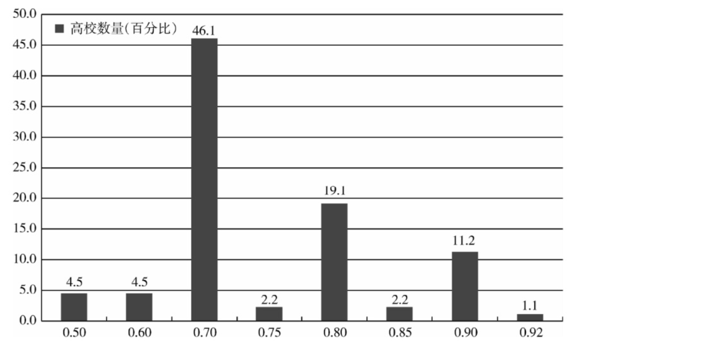
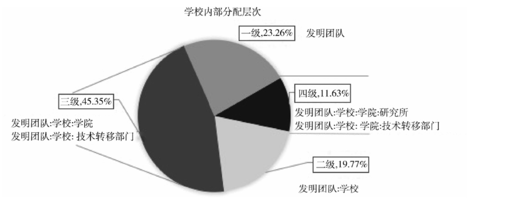
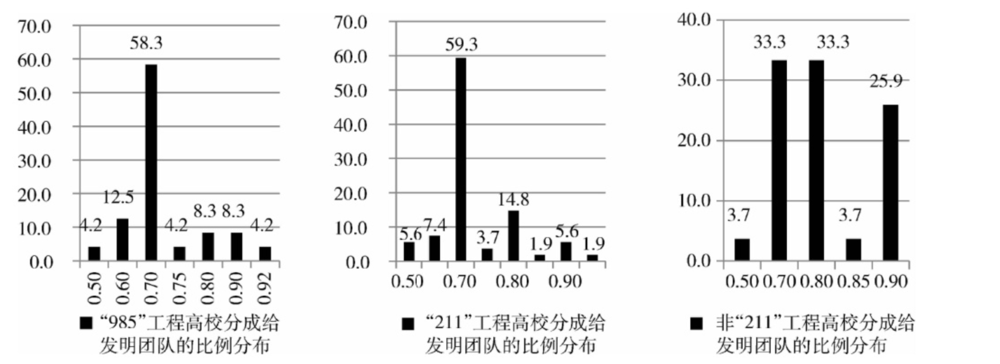
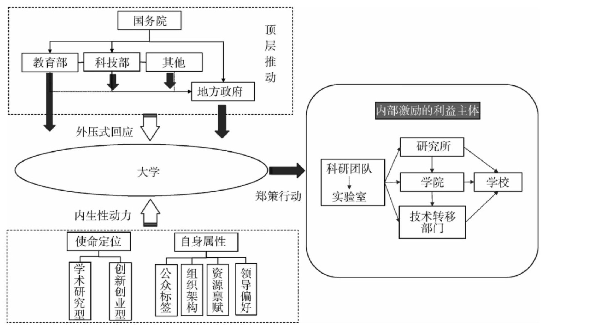

# 中国大学响应“拜杜法案”的特征及逻辑框架

作者: 王秀芹(清华大学公共管理学院,北京100084);薛澜(上海交通大学国际与公共事务学院,上海 200030);史冬波(上海交通大学国际与公共事务学院,上海 200030)

摘要:高校科技成果转化问题长期困扰着科技与创新领域,新修订的科技成果转化法(中国版“拜杜法案")下放收益处置权,以激励大学科技成果转化,大学对此如何响应关系到政策的激励效果。通过政策文献计量与访谈调研的质性方法,基于113份中国研究型大学出台的科技成果转化收益处置办法,分析了大学针对中国版“拜杜法案"的政策响应特征;研究结果发现,中国大学出台的科技成果处置收益在内部利益主体分配方案上呈现异质性特征,相比于以"985”“211"工程为代表的高水平大学,中国的地方性大学对科技成果转化政策的回应更“积极”,科技成果转化意愿更高。进一步,基于中国特色的政策过程理论及大学自组织性理论,尝试提出了中国大学响应科技成果转化激励政策表现的解释框架,一是“自上而下"的顶层设计及组织体系给予的"压力性"回应,二是基于大学的使命定位、自身特征产生的内生性动力,两者合力导致了大学的政策响应特征。激励大学科技成果转化需要充分考虑大学的内在自主性,并关注地方性大学在技术扩散与应用中发挥的作用。

关键词:大学;科技成果转化政策;中国版“拜杜法案”;政策响应;激励逻辑
中图分类号:G644.6
文献标识码:A

政府通过出台政策法规干预大学科技成果转移转化至关重要,最成功的案例当属美国拜杜法案的出台。近些年来中国政府一直致力于破除大学科技成果转移转化之“痛点”,为激发科研人员积极性,中国政府于2015年底修订科技成果转化法(俗称中国版“拜杜法案")并出台配套实施方案等一系列政策举措,其中改革的重点主要包括两个方面:一是加大对成果完成人和转化工作做出重要贡献的人员的激励力度,将奖励发明团队的收益比例的最低限由20%提高到50%;二是将转化科技成果的收益处置、激励制度等权力下放给大学,鼓励大学根据自身情况制定科技成果处置激励办法。

在加大奖励力度和下放权力的国家层面的政策激励下,中国大学会做出什么样的政策响应?响应是否存在规律性的差异特征?背后的原因又是什么?这是本篇论文试图回答的问题。

目前现有研究主要集中于规范视角下科技成果转化激励政策的制度设计,政策扩散特征,大学科技成果转化政策方面主要集中于大学科技成果转化体制机制如 TTO 模式建设,国外经验学习 等规范性研究,拜杜法案下的大学科技成果转化方面主要从政策评估的角度进行宏观政策效果的实证分析,鲜有研究探究中国大学作为创新主体之一,其在政府、企业等其他创新主体的多重作用下的科技成果转化行动特征及逻辑。

本篇文章试图弥补这一研究鸿沟。中国制度背景下中国高等教育系统呈现出985、211、地方属普通高校等分层特征,大学的分层起源于自身的科研积累,但也加剧了大学的分层分化。政策出台是政策行动的前提,政策文本是政策主体行动目标的表达方式,反映大学的意图。本篇论文以113份中国研究型大学出台的科技成果转化收益处置办法为政策研究样本,分析了中国研究型大学响应新科技成果转化政策的差异性特征,并尝试提出“外压-内生"双重作用的分析框架解释出现这一响应特征的原因。

本研究对于指导进一步完善我国国家及区域创新系统具有重要意义。本研究发现侧面反映了中国不同类型大学在参与全球化知识生产与服务区域化应用等不同使命之间存在内在分配偏好,一刀切的政策干预可能带来大学行为的异化,从而导致效率的损失。大学尤其是研究型大学在国家创新系统中的使命与定位问题仍然是科技创新治理现代化过程中需要深入研究的关键问题,它关系高等教育体制与创新发展之间的协同问题。本研究对于识别中国大学特别是研究型大学在创新系统中的功能定位具有一定的贡献,可以帮助政策制定者反思不同类型大学在科技成果转化体系中的不同作用。

## 1大学科技成果转化文献综述

### 1.1概念界定

对话大学科技成果转化文献首先需要界定科技成果转化的概念内涵。国内对科技成果及科技成果转化最权威的定义出自科技成果转化法,2015年新修订的《转化法》中将科技成果定义为“通过科学研究与技术开发所产生的具有实用价值的成果”,将科技成果转化定义为“将科技成果向直接产生经济效益的现实生产力进行转化的过程”,“为提高生产力水平而对科技成果所进行的后续试验、开发、应用、推广直至形成新技术、新工艺、新材料、新产品,发展新产业等活动。”而对应西方文献,科技成果转化主要与技术转移(technologytransfer)、研究商业化(research commercialization、commercialization of u-niversity)等学术概念的内涵相似

大学作为科技成果的重要生产者,科技成果转化已经成为其第三使命即服务社会的重要面向。根据上述的概念界定,大学的科技成果转化即是学术知识的商业化,是指将具有商业化潜力的研发成果向企业或其他机构转移转化的过程。《转化法》指出了大学科技成果转化三种正式的途径,即技术转让、技术许可以及作价投资等,三种途径的不同之处在于大学对知识产权的垄断使用方式。事实上,大学与企业产业之间除了正式的合作研发项目、专利申请、大学衍生企业等技术转移方式,还可以通过咨询、专业培训等多种非正式关系与进行合作,从而间接促进了大学知识向企业的转移转化。总之,大学科技成果转化的内涵覆盖科技成果从生产到商业的活动过程,是大学主体及内部组织与其他创新主体的互动的结果。

## 1.2“拜杜法案"与大学科技成果转化

大学科技成果转化是一项系统工程,涉及主体多,转移链条复杂且非线性,因此影响大学科技成果转化效率的因素非常多。现有学术文献主要从制度激励、社会资本、中介组织(TTO 等)建设、人力资本、校企合作网络等方面对大学知识向产业转移过程中的机制、问题及绩效等进行了研究。其中,基于制度的政策激励被证明是促进大学科技成果转化的关键因素。美国1980年颁布的《拜杜法案》(及后续配套补充法案)是促进科技成果转移转化的最重要的激励制度之一,之后这项制度被创新扩散到全球多个国家,成为其他国家效仿学习的范本。美国《拜杜法案》(及后续配套补充法案)明确了科技成果的处置和收益分配权,美国高校通过制定收益分配制度,合理划分涉及的收益分配主体包括科研单位、科技人员、院系(所)以及技术转移办公室(TTO)之间的利益分配模式和分配关系,拜杜规则出台有效地激励了各个主体进行科技成果转化的积极性和创造性。现有文献对拜杜法案在多大程度上激励了大学的专利生产与技术转移做过很多研究,实证结果显示在不同长短的时间维度上,拜杜法案的激励效果及程度有所不同,总体上来说,拜杜法案对高校专利申请的数量和质量均产生了积极的影响。

中国场域下的大学科技成果转化是解决科技与经济两张皮症结的重要着力点。中国政府一直致力于从体制机制方面下手,经过多年的制度演化与完善,无论是政策组织结构还是政策工具内容,我国已经基本形成了相对完整的政策体系。从政策扩散程度上看,科技成果转化法规类政策科技成果转化相关政策已经逐层扩散到各个主体,呈现出扩散覆盖面广,扩散强度高的特点,无论从中央政府到地方政府再到高校科研院所,基本均已形成科技成果转化的意识与政策依据。2015年中国全国人大常委会对1996年颁布的《中华人民共和国促进科技成果转化法》进行了修订,明确规定在研究开发和科技成果转化中作出主要贡献的团队或个人,获得奖励的份额不低于总额的50%。紧接着,2016年教育部依据新修订的科技成果转化法出台促进高校科技成果转化的指导政策,鼓励大学根据自身情况制定科技成果处置办法,是进一步明确下放成果处置权力给大学。这一制度性突破到底将如何影响中国大学科技成果转化是政府、企业以及学术界关心的关键问题。

现有针对“拜杜法案”与大学科技成果转化的研究,主要集中于规范性的政策制度设计以及实证性的政策效果评估,关注的政策效果也主要是从专利申请数量以及授权数量等作为政策效果测度,鲜有研究从政策响应的视角去评估拜杜法案这一制度突破下,大学是如何进行政策响应的。事实上,客观地对此政策效果进行评估还需要给予较长的政策周期,但大学如何针对此项改革做出政策响应是进行初步评估的一个出发点;本篇论文正是以此为研究切口,在下放分配权以及明确分配收益比例的全国性政策导向下,中国大学将如何做出政策响应是本文研究的核心内容,弥补了现有针对大学科技成果转化研究的鸿沟。

## 1.3政策响应

政策响应是经济学、政治学、地理学等领域的核心研究主题之一。政策响应的内核是一个反馈机制[,代表主体反馈的过程,机制中包括刺激源、感受器以及效应器三个参与主体。组织或者个体针对特定政策做出响应,特定政策即为刺激源,组织或者个体为感受器,采取的行为措施为效应器,其反馈的结果可以分成正反馈和负反馈。本文所指的政策响应是指自上而下的政策传导和反馈,不仅包含表面上的政策采纳,更包含实质性的反馈力度。政策响应的研究主要从影响响应的内在驱动因素以及政策响应的扩散机制两个方面开展的研究,不同的议题下内在驱动因素存在较大的异质性,和特定政策和感受主体类型密切相关。而扩散的机制主要包括政策扩散的扩散机制包括学习,模仿,规范性压力,竞争和强制五种。本文所指的政策响应主要针对2015年新修订的《科技成果转化法》,大学这一“感受器"是如何进行反馈“效应"的。

2015年人大常委会出台科技成果转化修订法之后,国务院接连出台《实施<中华人民共和国促进科技成果转化法>若干规定》《促进科技成果转移转化行动方案》等配套政策,在国务院一系列政策的带动下,各大部委及地方各级政府纷纷出台相应的科技成果转化办法。其中,教育部会同科技部于2016年8月出台《加强高等学校科技成果转移转化工作的若干意见》,并于10月出台行动计划,要求各所教育部直属大学限期内出台激励办法。在教育部等部委及地方政府的双重管辖及影响下,大学出台科技成果处置办法的密度于2016年底达到顶峰。中国大学对于中央政策的科技成果转化激励政策做出怎样的响应以及背后存在什么样的机制是本篇文章以下部分要回答的问题。

## 2大学响应科技成果转化政策的异质性特征

### 2.1 数据与方法

本文以大学出台的科技成果收益处置办法为分析样本,重点分析其政策响应的内容。本文通过对所有具有博士培养点的高校网站以及在搜索引擎通过“科技成果收益处置”“科技成果转化”等关键词进行网络爬取,截止到2017年3月底,113所大学出台科技成果转化处置办法激励科研人员进行科技成果转化。政策文本中最关键的激励变量是大学内部不同利益体之间的成果收益分配,重点是课题组团队可以享受的成果收益比例。

### 2.2 响应的异质性

#### (1)给予发明团队的分配比例不同

政策出台是政策响应的直接表现,是政策执行的基础。政策文本内容反映政策响应的效应。从给予重要贡献人员的分配比例来看,本文假定比例的高低代表政策响应的效应强度,比例越高,代表大学激励科技成果转化动力越大。新修订的《科技成果转化法》中规定给予重要贡献人员的分配比例不低于50%。若大学不自行制定标准,则按照此标准执行。统计数据显示,不同大学给予发明团队比例存在比较大的差异。在出台收益分配细则的大学中,团队成员最低分成比例为50%,最高比例达到95%。部分学校给定的是浮动比例,例如四川大学、华南理工大学、燕山大学等。其中,研发团队分成比例为70%的比重最大,占到50%。分成比例为90%以上的大学占13%。

#### (2)对学校内部利益主体的的分配层次不同

高校科技成果转化工作的实施与完成是一项复杂的系统工程。仅仅在高校内部,就涉及多个利益主体。从实施单元上看,主要包括学校、学院、研究所、课题组、技术转移中心/科技成果转化服务中心等。从利益分工上看,主要包括参与成果转化的行政领导、发明成果的科研人员、负责实施的技术转移人员等。不同学校的研究组织形式不同,收益分配的分成层次不同。统计上看,近一半的学校将收益分配成三级,分别是课题组团队、学校、学院;也有一部分学校将收益分成三级,但并不是分配给学院,而是给技术转移中心;一部分学校将分成收益分成两级,即发明团队和学校;有一部分学校将分成收益分成四级,明确出给予技术转移中心的比例;也有一些学校只明确了给予发明团队的比例,并没有细化其他部分的分配办法。

图1发明团队收益分成比例的大学分布

图2大学内部收益分配层次

#### (3)发明团队收益的用途不一

大多数学校并没有在政策文本中明确限制发明团队的收入部分的使用办法。其中一些学校提出了更明确的使用/分配限制,一种形式是规定将其中一部分建立科研项目账户,作为横向课题经费管理使用;另一种是规定将其中一定比例(规定上限)一次性奖励给直接管理人员。另外,有一些高校提出专门科技成果转化专项经费账户,将高校收益部分专门用于科技成果转化工作,这种类型的高校,一般是三级分类,高校与技术转移部门合为一体,并未单独给予激励。

#### (4)大学类型不同,收益分配比例存在系统性差异,非211"高校响应更积极,科技成果转化动力更大

中国的大学种类比较多样,不同大学具有不同的定位和历史特征。中国所有的公立大学基本都已形成一个社会标签及大众印象。尽管“985”‘211”等分类标签越来越被“淡化”,但不得不承认这些标签在过去的时间里强化了大学的生源与科研项目资金的获取能力和资源积累。从而具有更强的学术能力和知识储备。本部分以“985”‘211”及其他类型普通高校为大学分类维度,统计分析其在科研团队激励比例上呈现规律性特征。

首先,从出台响应政策的大学分布看,211类高校的响应面更广。自教育部的要求时间周期内,在113所出台细则的高校中,211高校占比64%,非211高校比重36%;39所“985"高校中,2/3的高校通过出台细则进行了政策响应。

其次,从给予发明团队的收益比例分布看,非211高校给予发明团队的比例更高。211类高校给予发明团队的比例众数为70%,在非211类普通高校给予发明团队的比例在70%,80%,90%的分布都较高。39所“985"工程高校中,58.3%的高校的收益分配比例70%,其次是12.5%的高校分配比例为60%,高于70%的高校占比25%;112所‘211"工程高校(含985工程)中,59.3%的高校给予发明团队的收益分配比例为70%,其次是14.8%的高校分配比例为80%,高于70%的高校占比27.8%。其中‘211"工程非985"工程的高校中,高于70%的高校占比达到30%以上;在出台激励政策的32所非"211"高校中,给予发明团队的收益比例相比于"211"工程高校更高,从统计上来看,分配比例高于70%的高校占比达到60%以上,是“211"高校比例的两倍以上。

以上结果可以在一定程度上反映出非“211"工程高校科技成果转化的意愿更高,科技成果转化成果收益分配权力的下放对其激励效果更明显。

图3不同类型高校发明团队的收益分成比例分布情况(单位:%)

## 3一个解释框架

### 3.1强力的顶层设计决定了科技成果转化政策响应过程的“外压式”响应特征

中国取得的经济成就离不开中国的强国家传统,在科技领域也不例外。强大的中央政治集权体制具有迅速执行国家意志的组织机制。中国现有的政治体制下,重大的政策都是由中央制定,按照党政系统自上而下贯彻执行,“顶层”一旦推动,通常会产生“牵一发而动全身"的效果。高层领导小组作为顶层设计的最重要抓手,是高层政治家和行政官员进行集体决策的机构,其职能定位和运作机制是一整套正式的制度安排。中央政府部门与地方政府部门基于“上下对口,职责同构”的制度框架,对公共事务进行齐抓共管。就科技成果转化政策的组织体系来看,国家科教领导小组负责重大政策制定与决策,常设于国务院,小组成员由各部委的行政首长构成,包括发改委主任、教育部部长、科技部部长、国防科工委(或后来的工信部)部长、农业部部长、中科院和工程院的院长等,承担协调国务院各部门之间及部门与地方之间涉及的科技重大事项。在人大立法、国务院部署的强顶层设计下,国务院各职能部门到地方政府部门自上而下,层层推进,形成了具有中国特色的组织梯度。国家科技领导小组教育部、科技部等部委根据其分属职能出台部门规章,省级政府依据中央精神出台省级政策。国家科技领导小组①的调整是国家进一步强化科技领域顶层设计的标志。

1985年中央政府进行的科技体制改革,奠定了从事科学学术研究的高校参与商业化活动的传统,同时也形成了高校与政府之间的强组织的制度路径。由于科学研究成果具有公共物品的天然属性,政府对于生产公共物品的高等学校生产活动的控制与干预具有较强的合法性和必要性。一方面,从隶属关系上,高校的隶属关系很大程度上影响着其“自上而下”的政策响应与扩散。中国大学隶属关系主要分为央属和地属。央属中除了教育部直属,还有工信部等其他部委直属,地方属高校主要归属地方省级及以下政府管辖。一方面,基于大学的历史积累以及政府投入的马太效应,中国的大学在公众眼里也存在固化的“印象”分层。每个大学都存在一个标签和阶层,比如,有学者将前100名的大学分成6个层次。另一方面,政府与大学之间的权力控制关系还体现在大学领导的任命、以及教师的职称评定②上。政府对此两部分的控制权力使得高校在政策行动上更加谨慎。

基于中国政府-大学的权力结构和行政体制,中国的公共政策具有地方试点试验一前期充分酝酿→中央统一顶层设计→地方强力层层推进渗透一的的政策过程特征。自2008年以来,地方政府在R&D方面的投资超过中央政府,试图探索将科技作为促进本地区经济增长和社会发展的资源。大学作为重要的创新主体之一,中央政府以及地方政府均投入大量的R&D资金,用于科学研究与应用。当科技成果转移与转化是中央政府实施创新驱动发展战略的意志表达途径之一,科技成果转移转化提上政策议程时,高校成为政府实施政策的重要靶向。一旦中央政府进行顶层部署,政策会在中国特色的科层制组织体系下“自上而下"迅速扩散。因此,在中国特色的中央-地方-大学之间的组织权力关系下,中国大学在面临科技成果转化政策响应上,高校会积极给予“外压式"回应,以体现对于中央以及地方政府的服从。

图4大学响应科技成果转化政策的解释框架

### 3.2大学的自组织性决定了科技成果转化政策的“内部学习”深度

大学作为一个创新主体,其政策行为背后有其自己的逻辑。中国政府对高校虽然具有强大的控制力,但也赋予了很大的自组织性。组织是指系统内的有序结构或这种有序结构的形成过程,自组织以默认规则协调组织内各系统的运作,自发形成有序结构。当政府试图通过规划指导科技成果转化时,大学以及其他创新主体会通过强大的自组织性进行协同。大学的政策行为基础主要体现在以下两个方面:一方面,中国的大学的自身属性,不同的历史渊源特征、地理优势、资源禀赋以及领导的个人偏好等因素影响大学的行为。另一方面,中国大学的“内生使命”,即战略目标定位,把自我建设成什么类型的大学是每个大学都在思考的核心问题。学术研究型、创新创业型是中国大学的两种不同的战略目标。克拉克分类法采用科学能力、创业能力两个变量对大学进行测度。科学能力主要从高层次学术论文数量、在校研究生数量、院士数、诺贝尔奖获得数、联邦来源研究经费等指标测度;创业能力主要从专利数量、衍生公司数量、授权或转让专利数量、来自工业企业经费金额等指标测度;“双一流"的建设目标是更加偏向于学术研究型的定位。“创业型”大学的建设目标是更加偏向于创新创业型的定位。而事实上,埃兹科维茨认为创业型大学是在研究型大学③的基础上发展而来。但中国大学在寻求内生发展的道路上出现了具有中国特色的特征。目前将自我战略目标定位为创业型大学均为地方属本科院校,例如福州大学、临沂大学等。中国的研究型大学坚持传统的知识生产模式仍然可以获得充裕的教学与科研资源,参与的是全球的知识生产竞争。而地方普通院校有可能会选择服务地方经济发展的发展策略。自1989年以来,大学专利申请数量增长迅速。专利申请量的增加,一方面是国家科研经费投入的结果,另一方面也为大学获得经济利润提供重要机会,这是地方性大学将自我定位于创新创业型大学的原因之一。

当大学具有科技成果转化的动力时,大学会从其自身的组织思考如何激励其内部组织及行为主体(科研人员)以及组织协同外部资源进行科技成果转化。大学内部的利益相关群体除了学校自身之外,还有学院、研究所、实验室等多层管理及研究单元,最微观的组织是科研团队或个人。对个人层面的激励是最根本的激励,因为我们假设人是自利和理性的。从科学家自身来看,学术生产与创新活动是否是相互冲突呢?最新研究表明,对于大学教授来讲,实施科技成果转化并不影响其科研产出但这并不反映科学家的主观意愿,尤其在中国的文化传统影响下,中国的教授可能从主观上对科技成果转化并没有太强的意愿,尤其是在从来没有体验过科研成果转化带来的好处的情况下,不过本篇论文重点不是从微观的视角分析科技成果转化政策的激励。本文重点以大学为分析单元。科技成果的转移转化是一项系统工程,大学若想有效推动科技成果转化,对参与的主体都进行有效而合理的激励是重要前提,科技成果转化的收益的分配便是其中重要一环。基于职务的科技成果大都产生于实验室;实验室对口研究所或者学院,学校设立科技成果转化部门,不同学校的归口管理部门不同,有些成立专门的技术转移中心,并相对独立运营管理,有些设立在科学技术研究院内部,和科研项目管理在同一归□。而有些学校实验室自行聘用专业的技术转移人员。因此,学校自身的组织管理架构对涉及的利益主体能否有效激励影响科技成果转化政策的落地。

过去几十年里,中国大学面临的内外部环境发生了巨大变化。一方面,随着政府对大学研发投入的不断增加、科学研究的全球化竞争与合作的不断深入,中国大学在知识生产方面迅速积累,表现在发表科学论文的数量及质量都大幅提高,我国学术论文发表数量于2015年跃居世界第一位,高被引论文比例从1997 年的0.1%提高到 20%,追求“双一流"成为中国大学的奋斗目标;而另一方面,1985年中央政府进行的科技体制改革奠定了从事科学学术研究的高校参与商业化活动的传统。大学拥有海量的科技成果存量,仅2015年中国大学的发明专利申请量高达30多万件④,随着政府出台的“双创计划"等一系列创新政策的推进,促进科技成果转移转化成为很多大学寻求内生发展的重要途径,大学在知识的扩散溢出及商业化过程中承担更加重要的角色,建设“创业型大学”已经成为某些大学的发展战略。面临着双重的政策使命导向,一手是双一流建设,一手是创新创业,到底是侧重学术研究还是创新创业还是两手抓两手都要硬,承担“知识生产"和“知识扩散”的双重职能,面对“角逐学术排位"和“巨大商业盈利"的双重诱惑,中国研究型大学在国家创新系统中扮演着更加模糊不清的角色,在政府创新政策的落实中表现出了更加复杂的行动特征。

## 4结论和展望

本篇文章通过对新修订科技成果转化法后中国大学的响应政策的研究发现,中国大学对大学主体的科技成果转化响应呈现异质性特征,这种异质性归根结底来自于不同大学在自身特质及使命定位后自组织的结果。不同类型大学在创新创业的权重分配上已经形成了分层和分化,相比于竞相双一流的大学来说,非211类大学更有动力进行科技成果转化。

良好的机制可以形成“正向激励”,否则必然导致微观主体的行为扭曲。科技成果的成功转化是科学家、大学、政府、中介机构、企业等多个行动主体相互作用的结果。新修订的科技成果转化法若想长效激发创新活动,实现具有商业价值的实验室科研成果走向市场,创造社会福利,政策制定者必须立足于理性人的原始假设,考虑科技成果转化涉及的多元主体利益共赢,换句话说,从利益相关者角度来看,各个利益相关主体对于成果转化目标的认识性错位程度将决定科技成果转化政策的落实程度。

国家不同部委基于自身的定位和职能目标出台不同的政策,而不同部委之间的政策目标不同,如果没有进行有效整合,很容易产生冲突。科技部出台促进成果转化的政策,目标在于打破原有政策对于成果转化的制度障碍,促进大学的实验室创新走向市场进行商业化。教育部给中国大学提出“双一流"建设目标,旨在提高大学在全球的基础研究能力以及学科建设能力。不同部委的政策在中国高校进行落实时,不同大学会根据自身的基础积累、资源禀赋以及制度依赖,做出相应的执行策略。科教领导小组的成立可以减轻不同部委之间的目标错位和矛盾。而且对于发展中国家来说,知识的区域化应用比知识生产本身更重要,因此国家在统筹科技成果的转移转化这一系统工程时,需要统筹好全国与地方、前沿知识生产与区域知识应用之间的层次关系。

在内外部制度环境的变迁过程中,中国大学已经出现了科学研究与创新创业的路径分化与依赖,很多学者在研究大学科技成果转移转化效率的影响因素时,往往多关注大学的内外部因素,而恰恰忽略了对大学的双重功能以及两者之间是否存在冲突的考虑,而这也会直接影响到探究实现大学科技成果转移转化绩效的关键。

经过几十年的积累,中国一流大学的科学研究水平越来越强,在国际高质量期刊上发表的高质量学术论文所占比重越来越高,已经仅次于美国,跃居世界第二位,文章的国际影响力也在不断提高。目前全国高校都站在“双一流"学科建设的风口上,抢占各种优势资源和人才,追求世界一流大学和一流学科建设。国内一流大学的目标若定位于高质量论文的发表上,高校领导促进成果转化的意志会得到削弱,而地方高水平及特色大学在资源受限的内生困境中会更加依赖于科技成果转移转化的政策红利,推动中国地方创新发展。
