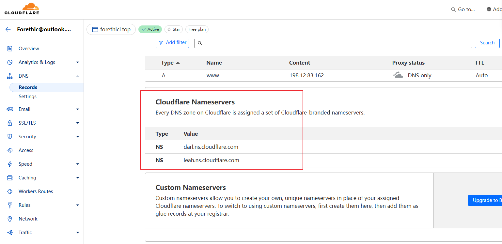
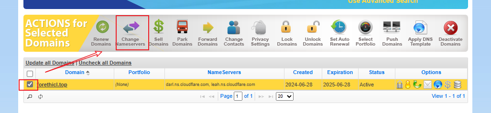
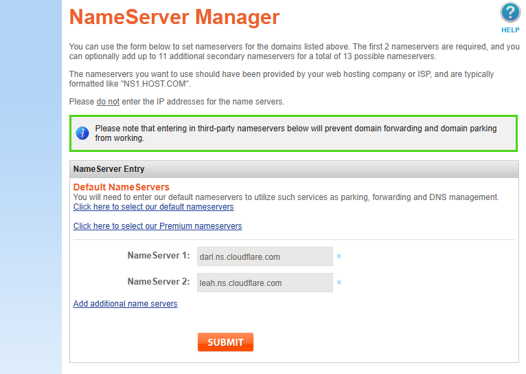
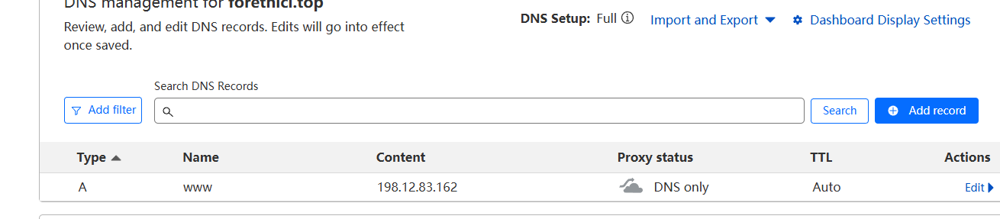

# Ubuntu22.04 搭建 VMESS

- 购买VPS `RackNerd`
- 购买域名 `Namesilo` - **www.forethicl.top**
- 配置 `Cloudflare`
- VPS 搭建环境

## RackNerd VPS

### SSH

- IP: 198.12.83.162
- port: 22
- Username: root
- Passowrd: 75uY0O8wI1AU9Pfmka

### Solus VM Control

- URL: [https://nerdvm.racknerd.com/](https://nerdvm.racknerd.com/)
- Username: vmuser182351
- Password: CzRGgrwe8T6TIzR

## 配置域名

### 配置 ns

Cloudflare 设置DNS会出现两个 nameserver

将其配置到 Namesilo上
)

等待新的NS生效，一般要2个小时

### 配置 域名和IP映射

在 Cloudflare上添加 A类型记录

## VMESS

[一键搭建Vmess教程](https://github.com/233boy/v2ray/wiki/V2Ray%E6%90%AD%E5%BB%BA%E8%AF%A6%E7%BB%86%E5%9B%BE%E6%96%87%E6%95%99%E7%A8%8B)

- address: www.forethicl.top
- port: 41530
- id: 23f2d0f6-f4bb-4a5a-a32b-5d3bbe976279
- network: tcp
- type: none

## 检测DNSSEC

[DNSViz](https://dnsviz.net/d/www.forethicl.top/dnssec/)
