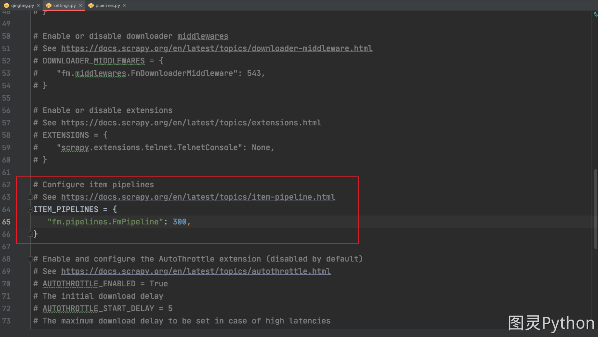

# 0005-scrapy-pipeline基本使用

## 标签

## 内容

scrapy的管道的作用: 将parse解析的数据进一步的处理,比如保存到数据库

1. 如果需要将数据通过pipeline保存,需要做以下的步骤
   1. 在爬虫文件的parse函数中通过 `yield` 返回解析的数据
      1. 传递给管道的话，数据类型只能返回 None、dict、Request、BaseItem 类型
   2. 将settings.py 中的 ITEM_PIPELINES = {} 解除注释
      1. 
   3. 在pipelines.py 中的process_item编写数据保存逻辑

## 参考
