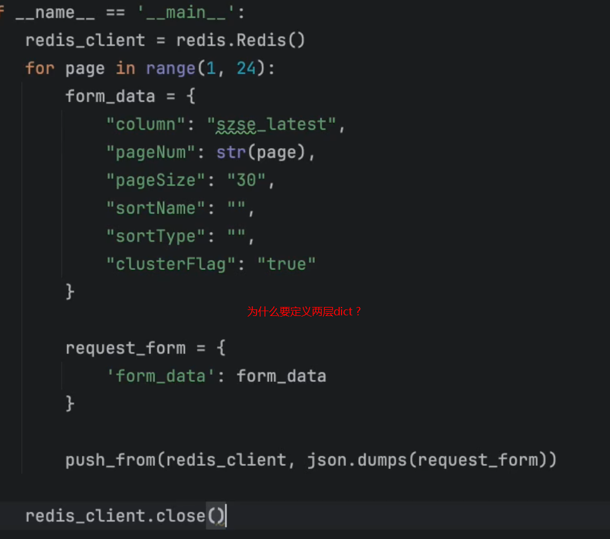

# 0001-scrapy-redis-表单请求

## 标签

## 内容

1. spider脚本类继承 RedisSpider
2. 重写 make_request_from_data 方法
3. 创建新的py文件，push_start_form_data, 构建所有页面的请求form数据 

> data 存储在redis中的，表单数据
> url 不用存在redis，因为post请求的url始终保持一致
>
> 注意：make_request_from_data 是用return 而不是yield
> 表单数据用 FormRequest，载荷数据用 JsonRequest

## 参考
