# 集团企业IT基础设施与信息安全架构规划方案

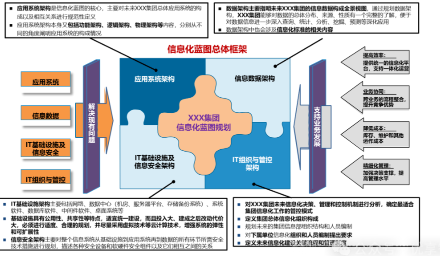

## 1. 企业数字化转型战略与目标

- 1条主线：以支撑整个集团的完整业务价值链和有效的集团管控为主线，打造集团、各下属企业统一架构的信息化一体化平台
- 2个集成：
  - 业务流程集成：未来集团的主要业务以通过**集成一体化的核心体系**，打通集团与下属企业、部门和管理层级之间的“经脉”，实现业务流程的有效集成与衔接
  - 信息集成：未来集团通过建设业务综合决策分析系统和生产调度指挥平台等系统，从生产经营线一直到管理决策的信息能够在合适授权的前提下得到充分的集中、集成、共享和分析利用
- 3个层次，指的是未来集团的整体信息化架构依据企业管理架构，
  - 决策支持层
  - 经营管理层
  - 业务运营层
- 4个支撑，指的是未来集团应建立
  - 有效的**信息化组织与治理体系、**
  - 统一适度的**信息化标准体系**
  - 健壮稳定富有弹性的**信息技术基础设施体系**
  - 强大的有效避免风险的**信息安全体系**

### 1.1 数字化转型战略意义

#### 1.1.1 支持业务发展与管理优化

- 数字化转型紧密围绕集团业务发展需求，通过信息化手段实现**业务流程**的优化与创新，提升业务运营效率，增强企业核心竞争力。
- 通过建立统一的信息化平台，实现跨业务的流程整合，打破部门之间的信息孤岛，提高业务协同效率，从而更好地支持集团的战略发展

#### 1.1.2 加强集团管控与决策效率

- 通过信息化架构的规划与建设，加强对集团各下属企业的管控力度，实现对业务数据的实时监控与分析，为管理层提供准确、及时的决策依据
- 建立决策支持系统，利用大数据分析技术对企业的财务、生产、销售等数据进行综合分析，辅助领导和管理者进行科学决策，提高决策的准确性和及时性

### 1.2 数字化转型规划原则

#### 1.2.1 紧密结合集团发展战略

- 数字化转型规划以集团整体发展战略为指导，确保信息化建设与集团业务目标高度一致，为集团的长期发展提供有力支撑。
- 在规划过程中，充分考虑集团的战略定位、业务布局和未来发展方向，将信息化建设与业务发展紧密结合，避免信息化建设与业务发展脱节

#### 1.2.2 适度超前与可拓展性

- 在满足当前业务需求的基础上，适度超前规划，采用先进的技术和架构，确保信息化系统具有良好的可扩展性和适应性，以应对未来业务发展的变化
- 在选择技术架构时，优先考虑云计算、大数据等前沿技术，同时注重系统的灵活性和可拓展性，以便在业务规模扩大或业务模式发生变化时，能够快速进行系统升级和扩展

## 2. 信息化架构规划

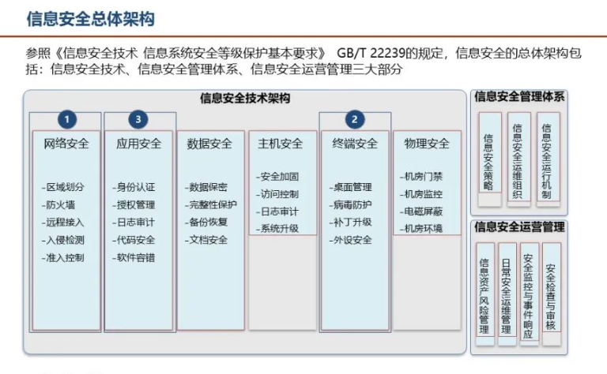

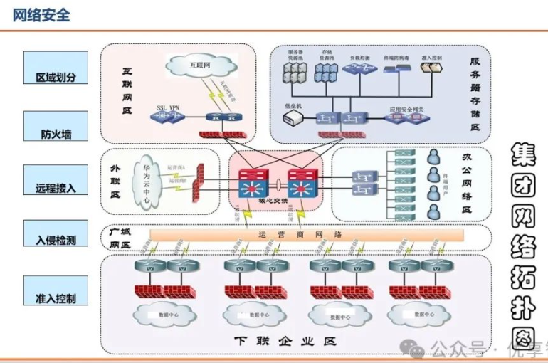

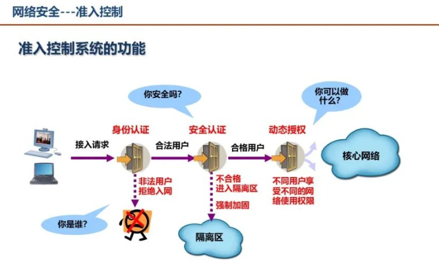

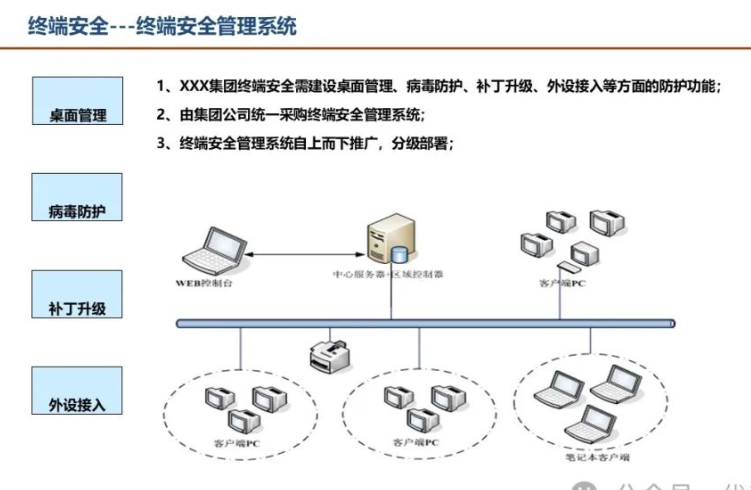

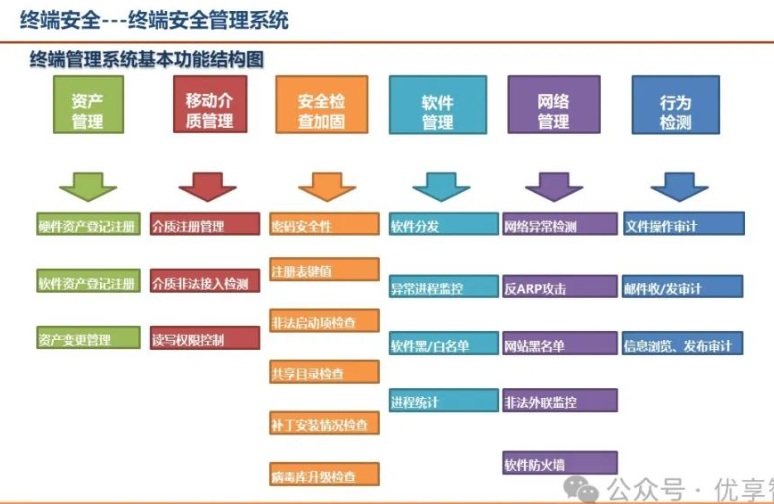

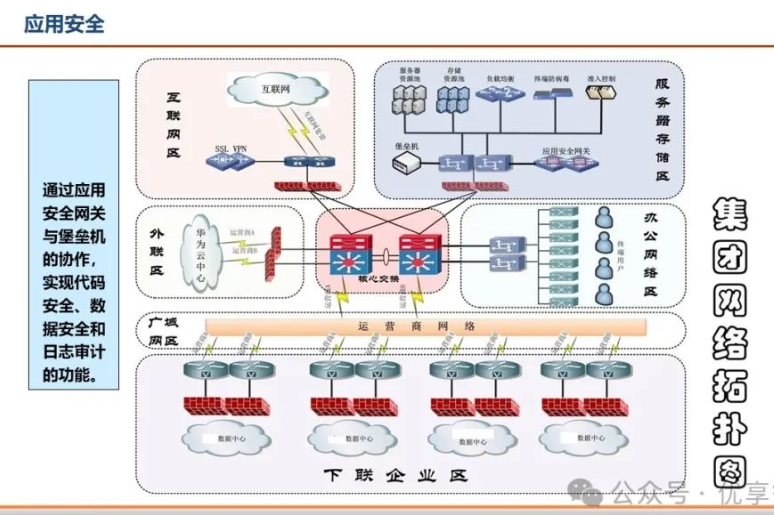

### 2.1 数据架构设计

#### 2.1.1 数据全景视图构建

- 明确集团未来信息数据的构成，包括数据的来源、分布、性质等，形成完整的数据全景视图，为数据的深入应用提供基础
- 通过对企业内外部数据的全面梳理，构建涵盖生产、销售、财务、客户等多维度数据的数据全景视图，为后续的数据分析、挖掘和预测提供数据支撑

#### 2.1.2 数据深化应用规划

- 规划数据的查询、统计、分析、挖掘、预测等深化应用，提升数据的价值，为企业的决策和业务创新提供支持。
- 利用数据分析技术对客户数据进行深度挖掘，了解客户需求和行为模式，为企业制定精准营销策略提供依据，从而提升客户满意度和企业经济效益

### 2.2 应用系统架构设计

#### 2.2.1 应用系统构成与关系规范

- 对集团总体应用系统的构成进行规范性定义，明确各应用系统之间的相互关系，确保应用系统的整体性和协同性。
- 将集团的应用系统划分为财务系统、人力资源系统、生产管理系统等多个子系统，并明确各子系统之间的数据交互和业务协同关系，实现一体化运营

#### 2.2.2 功能架构与物理架构设计

- 从功能和物理两个角度对应用系统进行架构设计，确保应用系统的稳定性和高效性，满足企业业务发展的需求
- 在功能架构设计中，根据业务流程和用户需求，将应用系统划分为不同的功能模块，实现功能的模块化和可复用性；在物理架构设计中，合理规划服务器、存储、网络等硬件资源，确保应用系统的高性能和高可用性。

## 3. IT基础设施架构规划

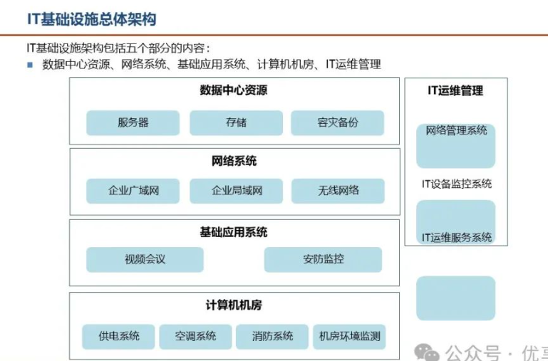

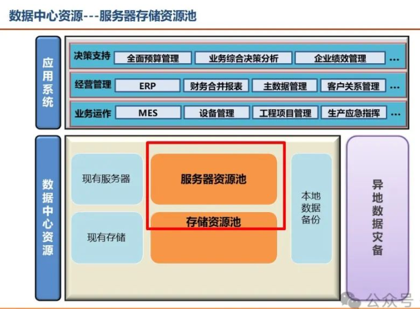

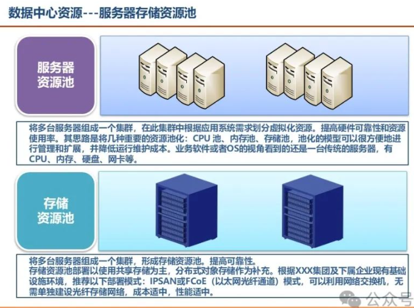

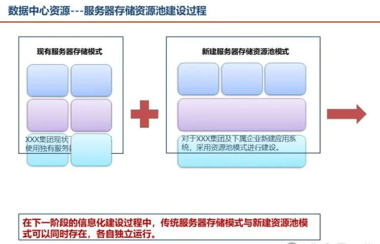

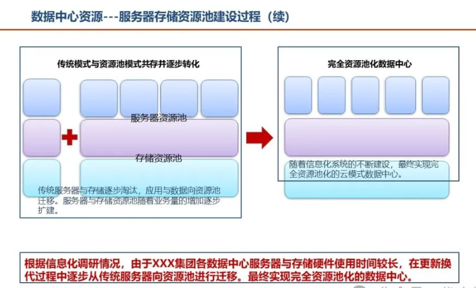

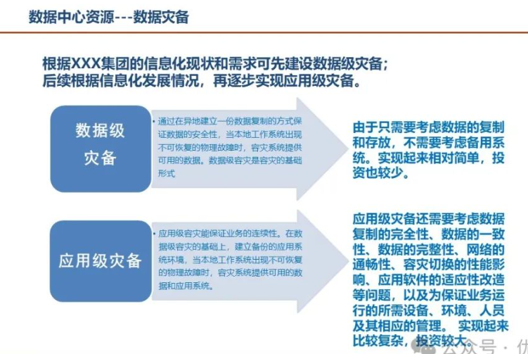

### 3.1 数据中心资源规划

#### 3.1.1 服务器存储资源池建设

- 采用虚拟化技术，将多台服务器和存储设备组成资源池，提高硬件资源的利用率和可靠性，降低运行维护成本。
- 通过构建服务器资源池和存储资源池，实现资源的动态分配和灵活拓展，根据应用系统的需求，快速调整资源分配，提高系统的响应速度和灵活性

#### 3.1.2 数据灾备体系建设

- 规划数据级和应用级灾备体系，通过本地备份和异地灾备的建设，确保企业数据的安全性和业务的连续性
- 采用数据级灾备技术，实现数据的实时备份和快速恢复；同时，逐步推进应用级灾备建设，通过在异地建立备用的应用系统环境，确保在发生灾难时能够快速切换，保障业务的正常运行。

### 3.2 网络系统规划

#### 3.2.1 局域网与广域网建设

- 规划集团局域网和广域网的建设，实现网络的分区部署、双机冗余和高速互联，满足企业内部和远程办公的网络需求
- 在局域网建设中，将网络划分为服务器区、办公区、生产区等多个区域，采用双机冗余技术提高网络的可靠性；在广域网建设中，通过建立高速的网络连接，实现集团总部与下属企业之间的数据传输和业务协同

#### 3.2.2 无线网络覆盖与优化

- 建设覆盖办公楼宇和生产车间的无线网络，支持移动办公和生产现场的移动应用，提高企业的运营效率
- 通过部署无线接入点和无线控制器，实现无线网络的全面覆盖和无缝漫游，同时优化无线网络的性能，确保无线网络的稳定性和安全性，满足企业移动办公和移动生产的需求

## 4. 信息安全架构规划

4 ·信息安全架构规划

### 4.1 安全技术体系构建

### 4.1.1 网络安全防护措施

- 部著防火墙、入侵检测、准入控制等网络安全设备，实现网络的区域划分和安全防护，防止外部攻击和内部安全威胁。·例如，在网络边界部署防火墙，对进出网络的数据进行严格过滤和访问控制，防止恶意攻击和非法访问；同时，通过入侵检测系统实时监测网络中的异帛行为，及时发现并处理安全事件。4 ． 1 ． 2 烬端安全防护体系·建立终端安全管理系统，实现桌面管理、病毒防护、补丁升级、外设接入等方面的防护功能，确保终端设备的安全性。比如，涌氵寸终端安全管理系统对终端设备进行统一管理和监控，及时发现和修复终端设备的安全漏洞，防止病毒和恶意软件的感染，保的终端设备的正帛运行。
