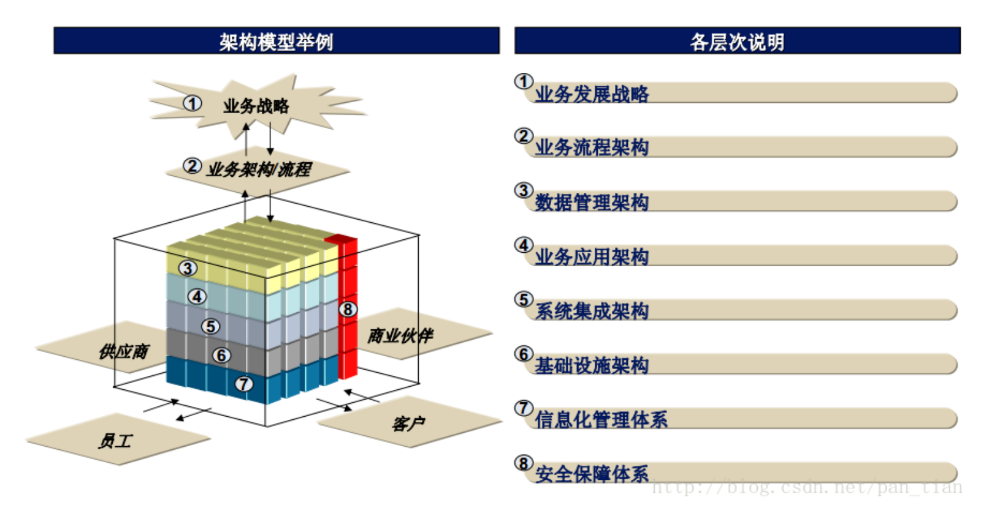
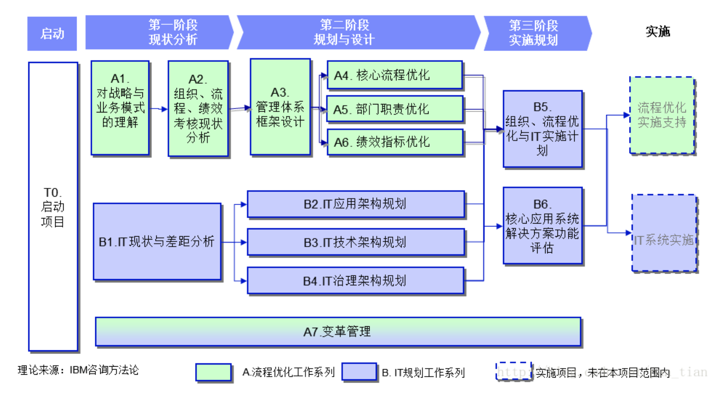

# IT战略规划项目方法论

## 德勤

1. 现状评估与需求分析阶段
   1. 战略及业务发展趋势分析
   2. 业务模式及流程明晰
   3. 业务需求分析
   4. 业领先实践分析
   5. 业监督要求分析
   6. IT现状评估
   7. IT差距分析
2. 远景规划阶段
   1. IT战略及IT工作策略
   2. IT远景蓝图规划
      1. 应用架构规划
      2. 数据架构规划
      3. 技术架构规划
         1. 集成架构规划
         2. 基础设施架构规划
         3. 信息安全架构规划
      4. 管理体系规划
         1. IT治理架构
         2. IT组织与职能
         3. 需求管理
         4. 外包管理
         5. 分支机构IT建设管理
         6. 其他领域概要规划
3. 实施计划制定阶段
   1. 实施策略与项目定义
   2. 关键项目投资收益分析
   3. 项目实施计划制定

> 项目管理/质量保障
> 变革管理/知识转移

## 埃森哲

## IBM

## 凯捷
