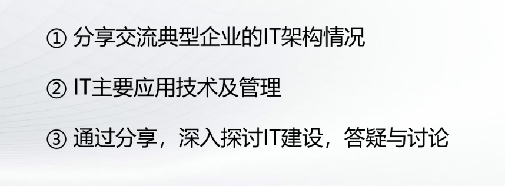
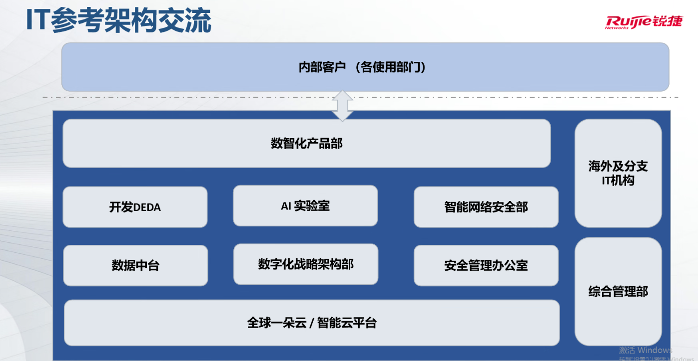
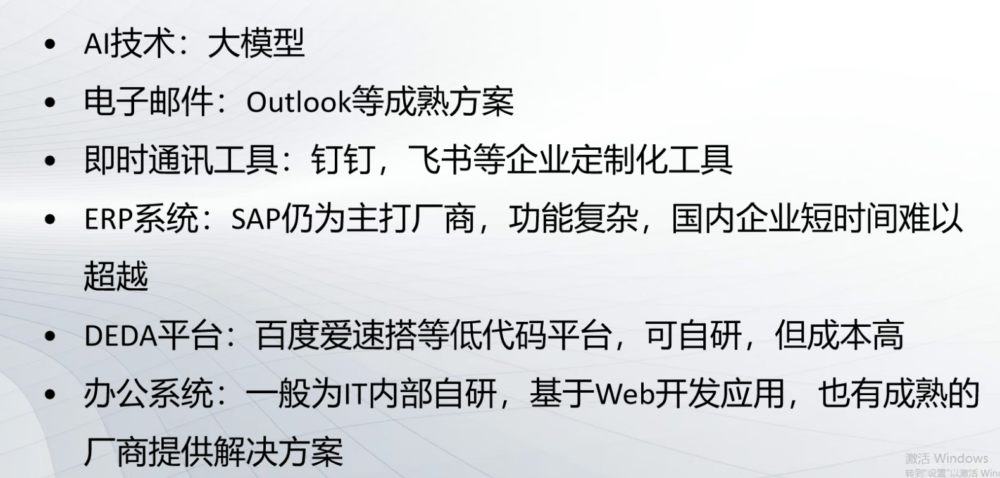
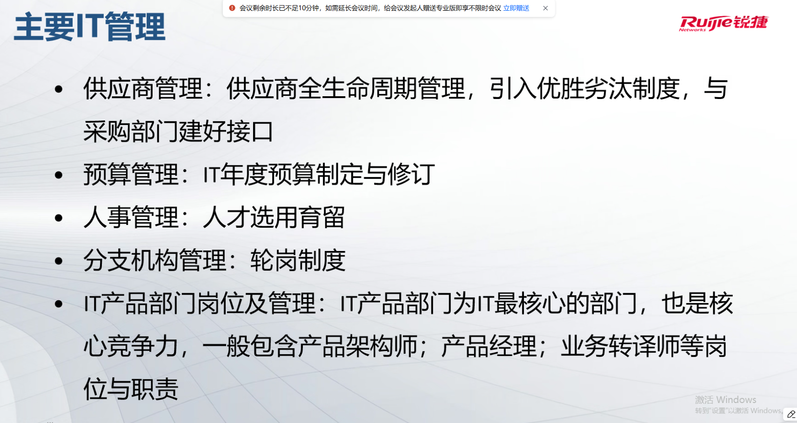

# 锐捷沟通信息化事项

郭金海 -- IT 部门管理

## IT 参考架构交流

前台：数智化产品部（对接各个部门，最核心）
中台：开发中台、安全中台（智能网络安全部 技术实施、安全管理办公室 制度，人员也不同）、数据中台（数据治理、实现数据标准化）、
后台：基础设施层（云原生环境）【混合云，私有云为基础【华为云技术在本地搭建】】
--一开始就要做到云原生，做到可拓展
--国外的话可以使用海外阿里云，
--服务器扩容比较麻烦，并且需要做异地灾备

综合管理部：人、财、物【供应商管理、资产管理】
战略架构部 --> 应该在海外分支和综合管理同侧

### 主要应用技术

- 机密系统要求是自研
- 一站式，做个
- 对飞书的评价，人性化【飞书文档比 office 更人性化】、竞争力很高、

技术平台要长看，供应商不能与时俱进的发展的话
选择国际化、有体量、有研发投入

一定要引入桌管软件，本地 P
行为监测

信息安全和文档保密的核心是政策制定 1.模仿攻击（安全演练） 2.模仿钓鱼短信

### 主要 IT 管理

### 战略规划学习资源

- 高德纳网站，gartner
- 麦肯锡网站，mckensey
