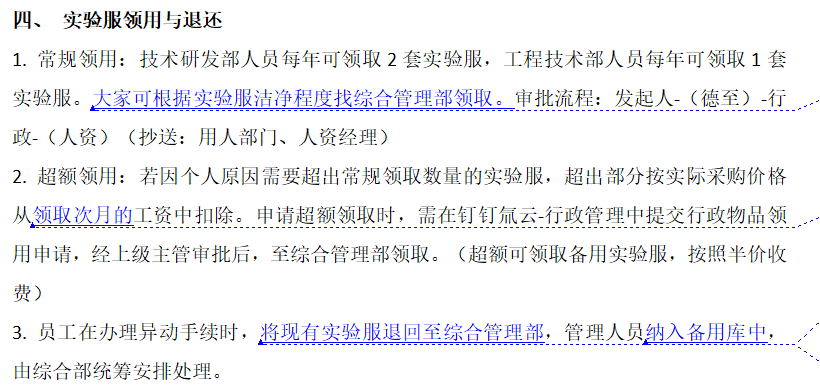

# 实验服领用与退还需求文档

## 一、引言

本文档旨在明确公司内实验服领用与退还全流程需求，规范技术研发部和工程技术部人员实验服的采购、领用、超额领用及退还操作，确保实验服管理流程有序、数据准确，实现库存精准管控。

## 二、功能需求

### （一）采购订单与入库单生成

**入库单自动生成**：采购订单审批生效后，系统依据订单内实验服不同尺寸，自动生成对应数量的实验服入库单。入库单需包含流水号、采购入库详情、关联采购订单表单编号、入库数量、入库时间等字段。

**库存实时更新**：实验服入库单审批通过后，系统自动更新实验服库存表，将对应尺寸实验服的库存数量按入库单数量实时增加。

### （二）员工领用申请流程

1. **领用规则与审批**

员工提交领用申请单时，需选择实验服尺码。系统根据员工类型（技术研发部、工程技术部）对应的年度可申请数量规则，以及申请单中的申请数量，触发不同审批流程：

若**申请数量≤可申请数量**：按常规流程审批，即发起人→行政（抄送上级主管、部门主管、人资经理）。

若**申请数量＞可申请数量**：按超额流程审批，即发起人→仓库管理员→行政→人资经理（抄送上级主管、部门主管、人资经理）。

2. **批量创建功能**：支持通过导入模板数据等方式，批量新增 2025 年度员工领用单，快速创建多个员工的领用申请。

3. **费用规则**：员工因个人原因超额领用实验服，超出部分费用从领取次月工资中按实际采购价格扣除；领用备用实验服按半价收费。

### （三）员工退还申请流程

1. **退还申请关联**：员工退还申请单设置子表，关联本年度已领用的实验服信息及数量。

2. **退还与库存更新**

员工离职时，系统根据员工所属部门自动发起退还申请，员工也可手动发起。

退还申请单经发起人→行政（抄送上级主管、部门主管、人资经理）审批通过后，由行政人员填写实际退还数量、可二次利用数量。

系统自动识别可二次利用数量，生成退还入库申请单，将其自动入库到实验服库存表对应尺码，实时增加库存数量。

## 三、表单字段说明

### （一）实验服入库单

| 字段名称 | 说明                 | 生成方式                 | 生效规则                                                     |
| -------- | -------------------- | ------------------------ | ------------------------------------------------------------ |
| 流水号   | 唯一标识入库单       | 系统自动生成             | -                                                            |
| 名称     | 实验服名称           | 来自采购订单中的订单明细 |                                                              |
| 数量     | 入库数量             | 来自采购订单             | 生效后，库存表对应名称实验服的库存数量增加 “入库数量” 字段值 |
| 入库时间 | 实际入库时间         | 系统自动记录             | -                                                            |
| 采购订单 | 关联采购订单表单编号 | 自动关联                 | -                                                            |

### （二）实验服库存表

> 展示关联实验服领用申请单、采购入库单、实验服退还申请单相关数据

| 字段名称 | 说明         | 生成方式                                       | 生效规则 |
| -------- | ------------ | ---------------------------------------------- | -------- |
| 数据标题 | 数据标识     | 手动填写或系统默认                             | -        |
| 名称     | 实验服名称   | 手动填写或关联入库单                           | -        |
| 库存数量 | 当前库存数量 | 依据入库单、领用申请单、退还申请单自动计算更新 | -        |

### （三）实验服领用单

> 设定定时创建任务

| 字段名称     | 说明           | 生成方式                   | 关联关系                 |
| ------------ | -------------- | -------------------------- | ------------------------ |
| 年度 - 人员  | 年度与员工标识 | 系统自动生成或批量导入生成 | 展示关联实验服领用申请单 |
| 人员         | 领用人姓名     | 批量导入或关联员工信息     | -                        |
| 部门         | 领用人所在部门 | 批量导入或关联员工信息     | -                        |
| 年度         | 领用年度       | 批量导入或系统默认         | -                        |
| 可申请数量   | 年度可领用额度 | 根据员工类型规则设定       | -                        |
| 实际领用数量 | 累计已领用数量 | 根据领用申请单自动统计     | -                        |

### （四）实验服领用申请单

> 审批流程:
> 申请数量≤可申请数量：发起人→行政（抄送上级主管、部门主管、人资经理）；
> 申请数量＞可申请数量：发起人→仓库管理员→行政→人资经理（抄送上级主管、部门主管、人资经理）

| 字段名称   | 说明                                | 生成方式             | 生效规则                                         |
| ---------- | ----------------------------------- | -------------------- | ------------------------------------------------ |
| 流水号     | 唯一标识申请单                      | 系统自动生成         | -                                                |
| 人员       | 申请人姓名                          | 关联员工信息         | -                                                |
| 实验服名称 | 申请的实验服名称，关联库存数量大于0 | 手动选择或关联库存表 |                                                  |
| 申请数量   | 申请领用数量                        | 手动填写             | 库存表对应实验服的库存数量减少 “申请数量” 字段值 |
| 可申请数量 | 当前剩余可申请数量                  | 系统自动计算         | -                                                |

### （五）实验服退还申请单

> 审批流程:
> 发起人→行政（抄送上级主管、部门主管、人资经理）
> 行政人员填写实际退还数量、可二次利用数量

| 字段名称       | 说明                 | 生成方式                           | 生效规则                                                         |
| -------------- | -------------------- | ---------------------------------- | ---------------------------------------------------------------- |
| 流水号         | 唯一标识申请单       | 系统自动生成                       | -                                                                |
| 名称           | 退还的实验服名称     | 关联领用单                         | -                                                                |
| 发起人         | 退还申请人           | 系统自动生成（离职触发）或手动填写 |                                                                  |
| 部门           | 发起人所在部门       | 关联员工信息                       | -                                                                |
| 应退还数量     | 按领用记录应退还数量 | 系统根据领用单自动计算             | -                                                                |
| 实际退还数量   | 实际退还数量         | 行政人员填写                       | -                                                                |
| 可二次利用数量 | 可再次使用的数量     | 行政人员填写                       | -         库存表对应实验服的库存数量增加 “可二次利用数量” 字段值 |

## 四、非功能需求

### （一）数据准确性

各表单数据录入时设置严格校验规则，如数量必须为正整数、时间格式规范等。

建立数据一致性检查机制，定期核对采购订单、入库单、领用单、退还单与库存表数据，确保数据准确一致，满足财务核算与库存管理需求。

### （二）流程透明度

系统记录各审批环节的操作时间、操作人员等信息，提供完整的审批日志，方便申请人与管理部门随时查询申请流程进度。

提供可视化的流程状态展示，如通过颜色、图标等直观呈现申请单所处阶段（待审批、审批中、已通过、已驳回）。

### （三）系统兼容性

确保涉及实验服管理的各功能模块与公司现有系统（如财务系统、人力资源系统）数据交互顺畅，支持常见数据格式的导入导出，具备良好的兼容性，避免因系统问题影响业务流程正常运转。

这份优化后的需求文档更清晰全面。你若觉得某些部分表述不够准确，或还有新需求补充，欢迎随时告诉我。
