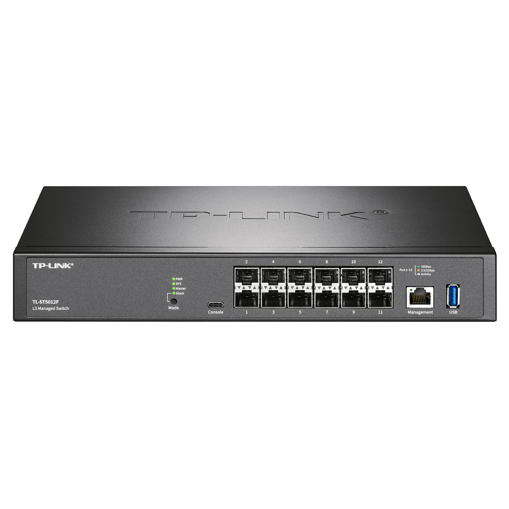

# TL-ER6120T 万兆企业VPN路由器

TL-ST5012F是TP-LINK最新推出的全万兆三层网管交换机，采用新一代高性能硬件和软件平台，提供全万兆光口，支持三层路由协议、完备的安全防护机制、完善的ACL/QoS策略和丰富的VLAN功能，易于管理维护，广泛应用于中小企业、酒店及园区网络汇聚、核心等应用场景。

- 四核CPU，512MB DDRIV高速内存，性能强劲
- 2个万兆SFP+光纤扩展口，4个10/100/1000M RJ45电口，可自定义端口类型
- IPSec/PPTP/L2TP VPN，远程通信更安全
- Web认证、短信认证、PPPoE服务器
- 上网行为管理（应用限制/网站过滤/网页安全）
- 负载均衡与线路备份
- 内外网ARP防护及常见攻击防护
- 智能IP带宽管理及连接数限制

## 全万兆光口

- TL-ST5012F提供12个万兆SFP+端口，满足高速组网需求。
- 强大的业务处理能力
- 支持RIP动态路由协议，动态生成、更新路由表，解决中小型网络划分子网后的路由问题。
- 支持静态路由，管理员手动配置路由条目，实现不同网段间的通信，简单、高效、可靠。
- 支持DHCP服务器，为网络中的主机分配IP地址。
- 支持DHCP中继，在不同的接口或子网中的交换机也能获取IP地址，减少DHCP服务器的数量。
- 支持代理ARP，让处在同一网段不同物理网络中的主机可以正常通信。
- 支持IEEE 802.1Q VLAN、MAC VLAN、协议VLAN、Private VLAN，用户可以根据不同需求灵活划分VLAN。
- 支持GVRP，实现VLAN的动态分发、注册和属性传播，减少手工配置量，保证配置正确性。
- 支持VLAN VPN功能，在公网接入端为用户的私网报文封装外层VLAN Tag，使报文携带两层VLAN Tag穿越公网。
- 支持QoS，支持基于端口、基于802.1P和基于DSCP的三种优先级模式和Equ、SP、WRR、SP+WRR四种队列调度算法。
- 支持ACL，通过配置匹配规则、处理操作以及时间权限来实现对数据包的过滤，提供灵活的安全访问控制策略。
- 支持IGMP V1/V2组播协议，支持MLD Snooping、IGMP Snooping，满足多终端高清视频监控和视频会议接入需求。
- 支持IPv6，满足网络从IPv4向IPv6过渡的需求。

## 完备的安全防护机制

- 支持IP地址、MAC地址、VLAN和端口四元绑定，对数据包进行过滤。
- 支持ARP防护，针对局域网中常见的网关欺骗和中间人攻击等ARP欺骗、ARP泛洪攻击等进行防护。
- 支持IP源防护，防止包括MAC欺骗、IP欺骗、MAC/IP欺骗在内的非法地址仿冒。
- 支持DoS防护，支持防护Land Attack、Scan SYNFIN、Xmascan、Ping Flooding等攻击。
- 支持802.1X认证，为局域网计算机提供认证功能，并根据认证结果对受控端口的授权状态进行控制。
- 支持端口安全，当端口学习MAC地址数达到最大数目时停止学习，防范MAC地址攻击和控制端口网络流量。
- 支持DHCP Snooping，有效杜绝私设DHCP服务器，保证DHCP服务器的合法性。

## 多样的可靠性保护

- 支持STP/RSTP/MSTP生成树协议，消除二层环路、实现链路备份。
- 支持生成树安全功能，防止生成树网络中的设备遭受各种形式的恶意攻击。
- 支持静态汇聚和动态汇聚，有效增加链路带宽，实现负载均衡、链路备份，提高链路可靠性。

## 轻松的运行维护

- 支持TP-LINK商用平云台，轻松远程管理、维护设备，减少现场运维成本。
- 支持Web网管、CLI命令行（Console，Telnet）、SNMP（V1/V2/V3）等多样化的管理和维护方式。
- 支持HTTPS、SSL V3、TLSV1、SSHV1/V2等加密方式，管理更安全。
- 支持RMON、系统日志、端口流量统计，便于网络优化和改造。
- 支持线缆检测、Ping检测和Tracert检测操作，轻松分析出现故障的网络节点。
- 支持LLDP，方便网络管理系统查询及判断链路的通信状况。
- 支持CPU监控、内存监控、Ping检测、Tracert检测、线缆检测。  
