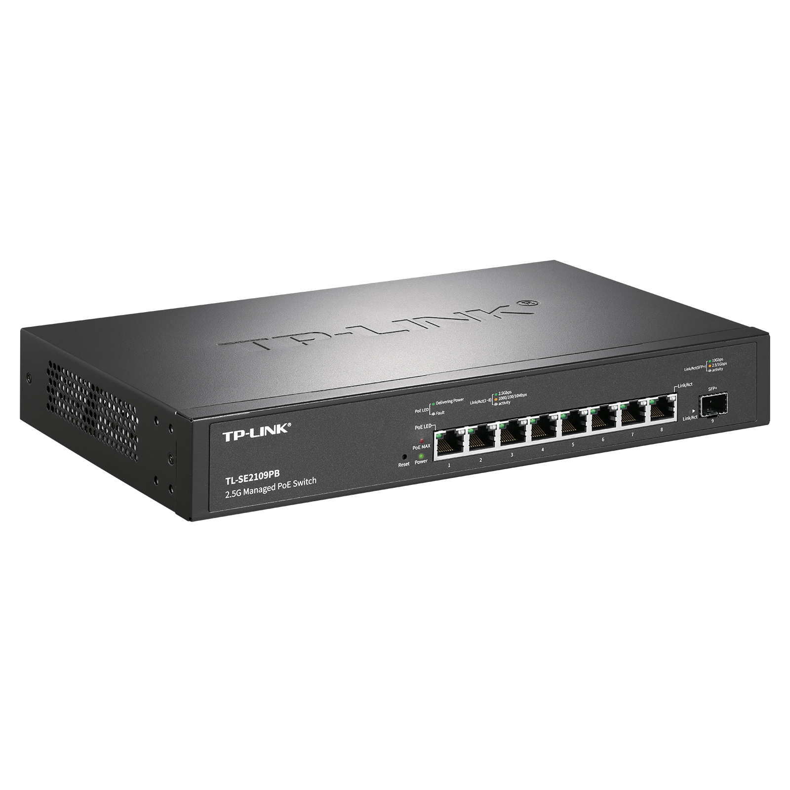

# TL-SE2109PB 2.5G云管理PoE交换机

- 8个10/100/1000/2500Mbps RJ45端口（支持标准PoE++供电）
- 1个1/2.5/10Gbps SFP+端口
- 整机最大PoE供电功率为235W，单端口最大PoE供电功率为90W
- 符合IEEE 802.3af/at/bt PoE供电标准，端口支持供电优先级
- 支持商云APP端及Web端远程管理
- 支持智能开局、异常告警、快速排障
- 支持802.1Q VLAN、Port VLAN、QoS、带宽控制、风暴抑制
- 支持端口汇聚、端口流量统计、端口监控、线缆检测、环回保护
