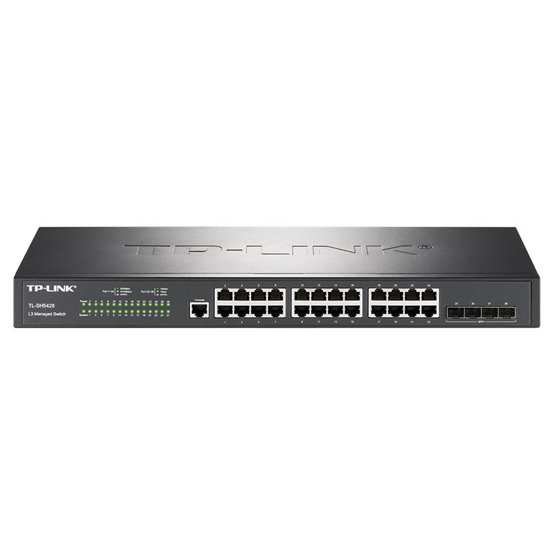

# TL-SH5428 万兆上联三层网管交换机

- 24个千兆RJ45端口，4个万兆SFP+端口
- 支持TP-LINK商用云平台远程管理，支持手机APP管理
- 支持智能开局，自动配置组网，拓扑图形化展示
- 支持RIP动态路由、静态路由、ARP代理、DHCP Server
- 支持四元绑定、ARP/IP/DoS防护、802.1X认证
- 支持VLAN、QoS、ACL、生成树、组播、IPv6
- 支持ERPS环网配置及RPL配置，提高网络可靠性
