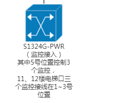

# TL-ST5012F 全万兆三层网管交换机

- 12个万兆SFP+端口
- 支持Type-C Console口
- 支持USB端口
- 支持RIP动态路由、静态路由、ARP代理
- 支持DHCP服务器、DHCP中继、DHCP Snooping
- 支持四元绑定、ARP/IP/DoS防护、802.1X认证
- 支持VLAN、QoS、ACL、生成树、组播、IPv6
- 支持Web网管、CLI命令行、SNMP
- 后续软件升级支持堆叠功能*
