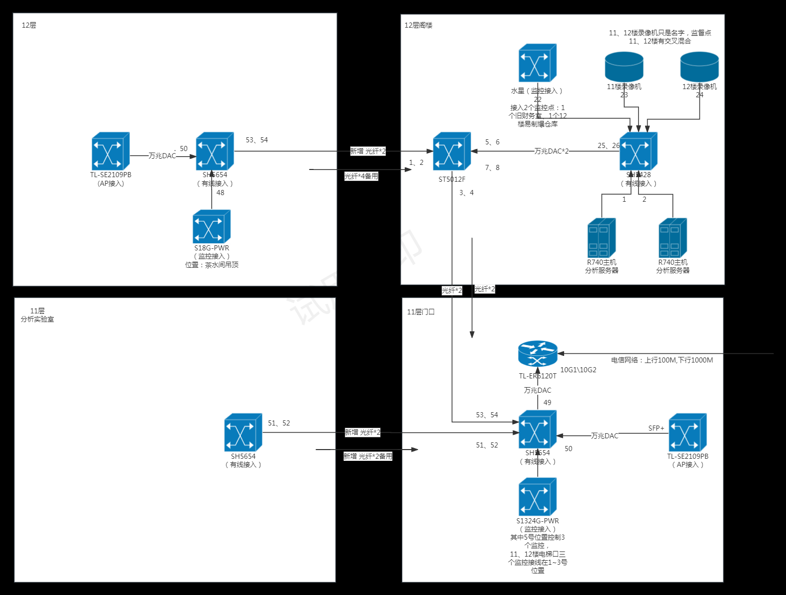

# 福州网络运维

## 医工科技大楼11，12层

### 拓扑图

### 设备列表

| 名称                  | 地点           | 产商    | 作用                       |
| --------------------- | -------------- | ------- | -------------------------- |
| [[TL-SE2109PB]]       | 12楼阁楼楼梯间 | TP-Link | 用于无线接入点的连接和管理 |
| [[TL-SH5654]]         | 12楼阁楼楼梯间 | TP-Link |                            |
| [[H3C-Mini-S18G-PWR]] | 12楼茶水间吊顶 | H3C     |                            |
| [[TL-SH5654]]         | 11楼分析实验室 | TP-Link |                            |
| [[TL-ST5012F]]        | 12楼阁楼       | TP-Link |                            |
| [[TL-SH5428]]         | 12楼阁楼       | TP-Link |                            |
| [[TL-ER6120T]]        | 11楼门口       | TP-Link |                            |
| [[TL-SH5654]]         | 11楼门口       | TP-Link |                            |
| [[H3C-S1324G-PWR]]    | 11楼门口       | H3C     |                            |

### 问题点

1. S18G-PWR 接入多少个监控，监控画质协议的采用
2. S1324G-PWR 接入多少个监控，监控画质协议的采用
