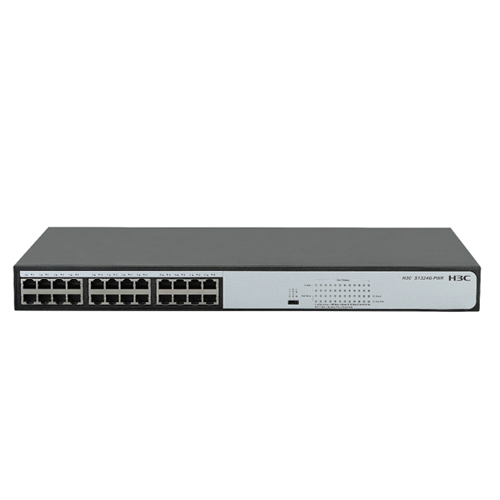

# H3C S1324G-PWR 全千兆以太网交换机

- 符合IEEE 802.3 10Base-T，IEEE 802.3u 100Base-TX，IEEE802.3x和IEEE802.3ab 1000Base-T标准；
- 全线速的二层千兆交换能力，保证所有端口无阻塞进行报文转发；
- 24个10/100M/1000M自适应RJ45端口；
- 支持POE+供电，整机支持190WPOE供电，单端口最大供电功率30W；
- 采用存储转发的交换机制；
- 内置通用电源，1U铁壳，19英寸机箱，工业级设计，可上标准机架；
- 采用共享缓存架构，每个端口可利用的缓存空间扩大数倍，可大大增强突发大流量的转发性能；
- 集成专业级防雷电路，可提供防雷等级4级（共模防护7KV）的专业防护；
- 支持三级拨码开关，标准交换、网络克隆、汇聚上联三种工作模式；
