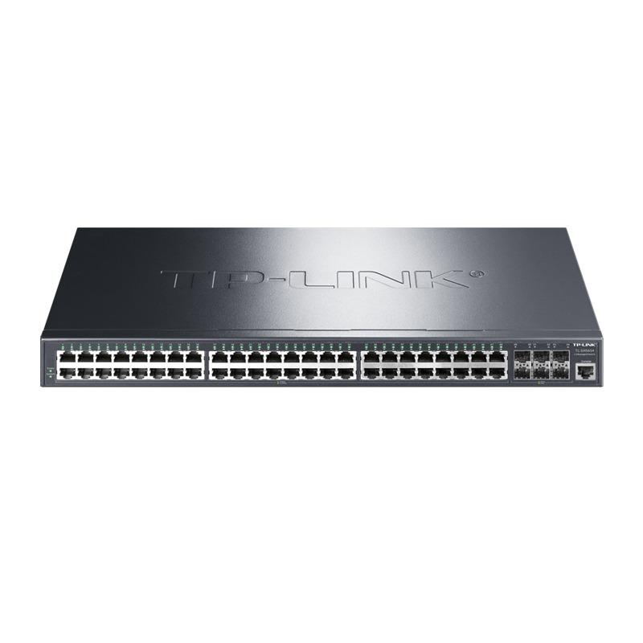

# TL-SH5654 万兆上联三层网管交换机

- 48\*GE+6\*10G SFP+
- 支持RIP动态路由、静态路由、ARP代理
- 支持堆叠，最大支持8个堆叠单元
- 支持DHCP服务器、DHCP中继、DHCP Snooping
- 支持四元绑定、ARP/IP/DoS防护、802.1X认证
- 支持VLAN、QoS、ACL、生成树、组播
- 支持CLI、Web、TUMS、商云平台、手机商云APP等方式管理
- 产品尺寸：440mmX220mmX44mm
