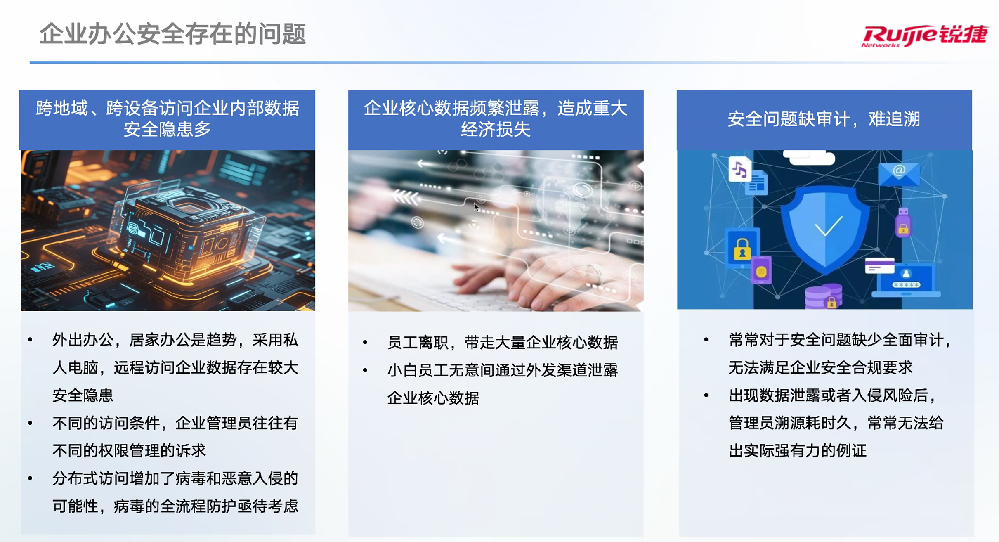
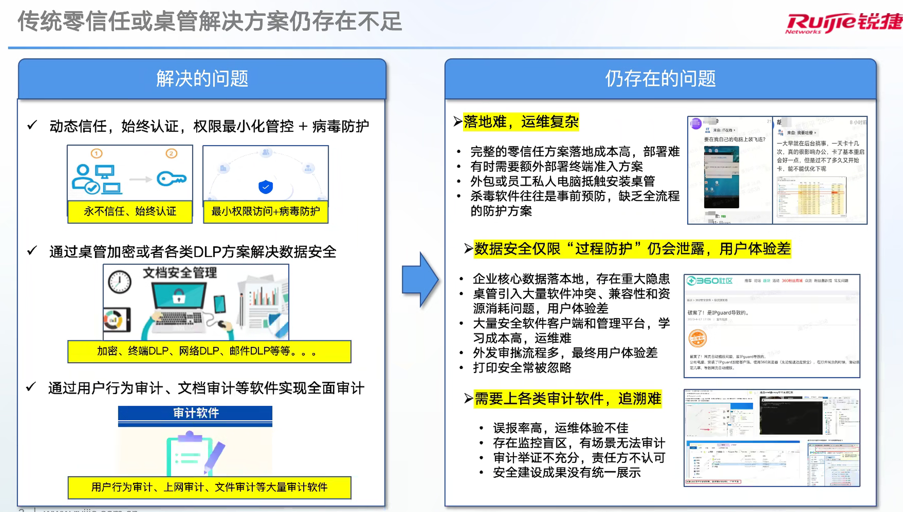
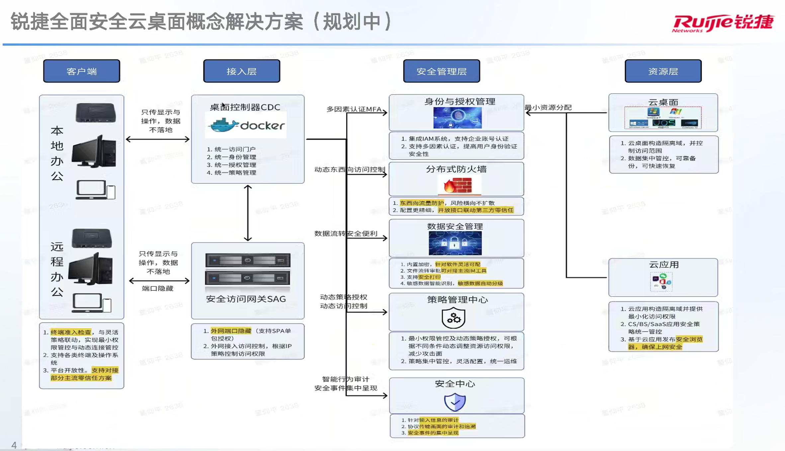
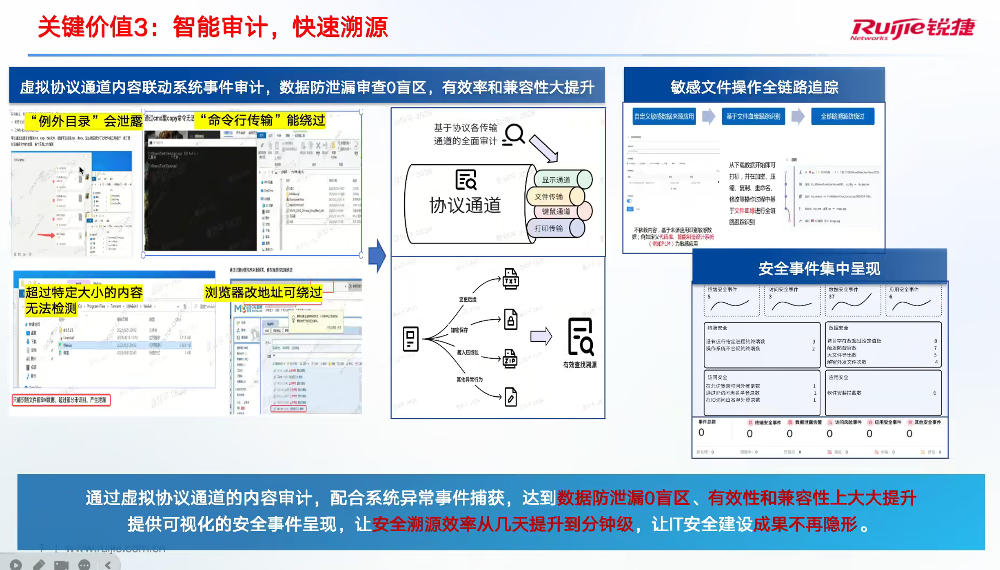

# 2025-08-28 工作内容

## 工作内容

### A 09:00-10:00 北信源线下沟通 ✅

图片截图管控管控

### A 10:40-12:00 锐捷沟通新版本安全桌管功能 ✅

亚信合作
亚信零信任单点登录
亚信无代理杀毒

### A 19:00-19:30 每日必做

- [ ] Foam-DialyTask-明日安排
- [ ] 微信汇报
  - [ ] 今日总结
  - [ ] 明日安排
- [ ] 钉钉
  - [ ] 日报
  - [ ] 下班打卡

---

## 总结

2025年8月28日 日报
一、信息技术支持【约3.5h】
1.桦智氚云积分管理系统优化
2.桦智氚云采购明细补充采购员信息，方便仓库员确定物品信息
二、信息化建设【约4h】
1.IPGuard报价进度跟进
2.云桌面线下沟通安全管控需求
3.北信源线下沟通

2025年8月29日 安排
一、信息技术支持
二、信息化建设
三、基础建设
